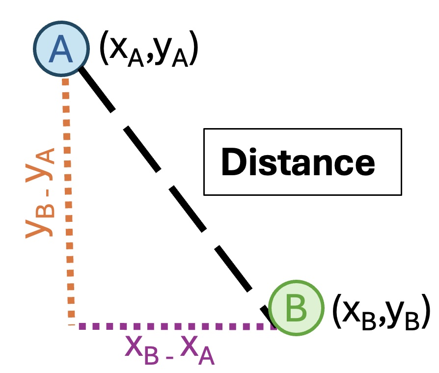
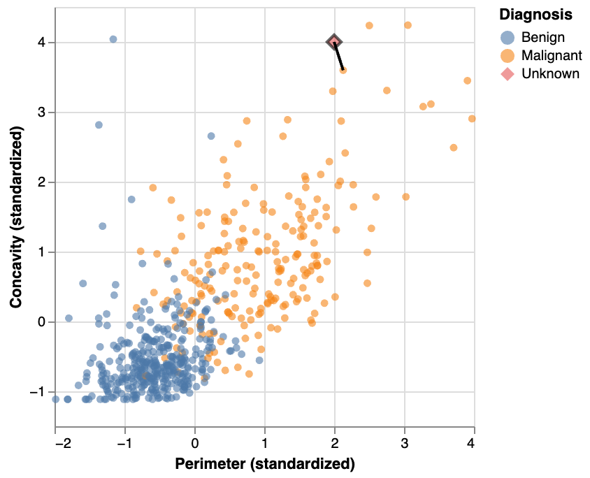
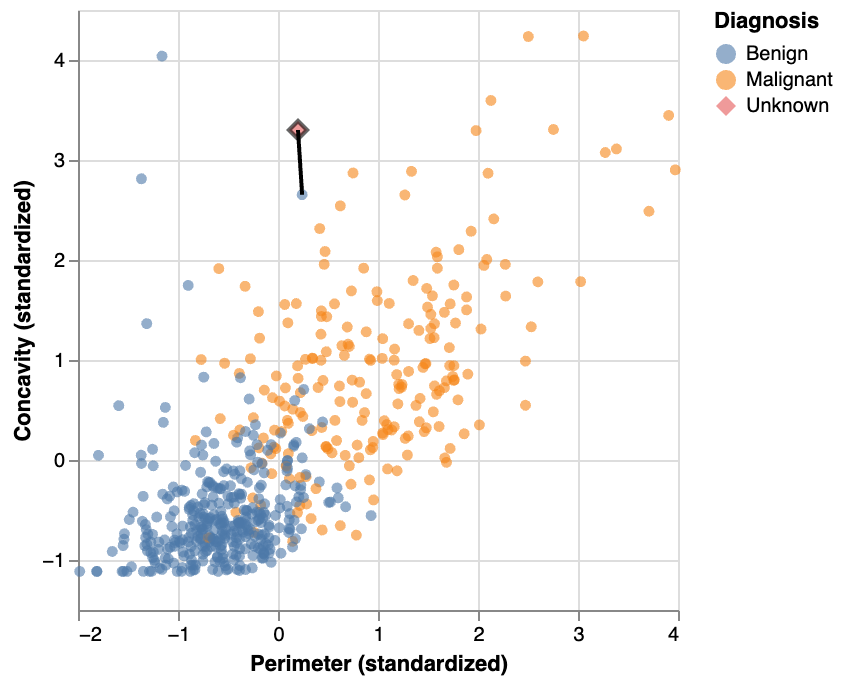
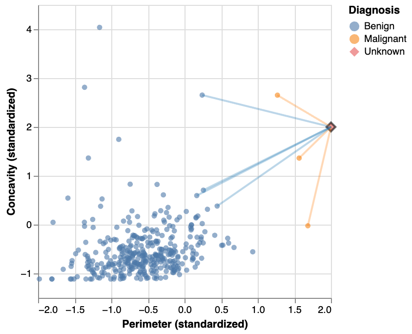
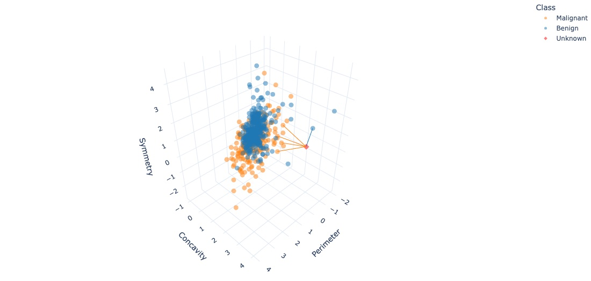

# Classification I
```console
Data Sciences Institute
Applying Statistical Concepts
```

---
##### Acknowledgements
- Slides created by Julia Gallucci under the supervision of Rohan  Alexander.
- Content adapted from: A First Introduction (Python Edition) Tiffany Timbers, Trevor Campbell, Melissa Lee, Joel Ostblom, Lindsey Heagy https://python.datasciencebook.ca/index.html
---
##### Learning objectives

- Identify when to use a classifier for predictions.
- Use a training dataset and explore its role in classification.
- Interpret classifier outputs.
- Implement K-nearest neighbors classification in Python with scikit-learn.
- Preprocess data using scikit-learn for centering, scaling, balancing, and imputing.
---


##### The classification problem

- Uses one or more variables to predict a categorical class (label) of interest.
  
- Binary classification involves two classes; multiclass classification involves more than two categories.

- *Examples:* 
  - Diagnose a patient as diseased or healthy
  - Tag an email as spam or not spam
  - Predict if a credit card purchase is fraudulent

---
 
- A classifier assigns a class to new observations based on their similarity to known observations (training set).
  
- Training sets consist of observations with known classes used to train classifiers.
- K-nearest neighbors is a widely used classification method.

  Other methods include decision trees, SVMs, logistic regression, and neural networks.
---
 ##### Example dataset
 - ​​Breast Cancer Wisconsin Dataset is a popular dataset in machine learning and data science for classification tasks, specifically for predicting whether breast cancer tumors are malignant or benign. 
- *Key features:* 
  - 569 samples of breast tumors (rows)
  - 30 features (eg., radius, texture, area, smoothness…)
  - 1 label of interest (Malignant; M or Benign; B)

---
 ##### K-nearest neighbors (KNN)

- KNN finds the "nearest" or "most similar" observations in the training set to predict a new observation's label.
- "Closest" can be measured by calculating the straight-line between points, known as distance.
- K is a predefined number of neighbors considered for classification.

---

To classify a new observation with K-nearest neighbors, follow these steps:
1. Determine the nearest observation to the new observation from the training set.
2. Identify the K observations that are closest.
3. Classify the new observation based on the most common class among these neighbors.
---
 ##### Distance metric
 - We determine the "nearest" points to our new observation using the straight-line distance (often just called distance).
- Suppose we have two observations, $A$ and $B$, each with two predictor variables, $x$ and $y$.


Observation | Variable x | Variable y | 
-----|------|:-----:|
$A$ | $xA$ | $yA$ |
$B$ | $xB$ | $yB$ |

---

 ##### Distance metric


The straight-line distance between observations A and B can be computed using the following formula: 
$$
\text{Distance} = \sqrt{(x_B - x_A)^2 + (y_B - y_A)^2}
$$

---

 ##### Example: K = 1
- New observation with an unknown diagnosis is a red diamond. The closest point to this new observation is malignant. 
- Points close together have similar perimeter and concavity values, suggesting they likely share the same diagnosis.


---

 - However, a nearest neighbor of 1 is **sensitive to noise.**
The nearest neighbor to this new point is a benign observation.
Does this seem like the right prediction? *Probably not*, considering the other nearby points.


---
 ##### Example: K = 3
- To improve the prediction, consider several neighboring points (e.g., 3) closest to the new observation.
- Here, we are using the majority class among these 3 closest points to predict the new observation's diagnosis.
- 2 of the 3 nearest neighbors to the new observation are malignant.

---
 ##### Impact of Variable Scaling on Prediction
 - In K-nearest neighbors classification, the **scale** of each variable affects predictions.
- Variables with larger scales (e.g., salary) have a bigger impact on distance calculations than variables with smaller scales (e.g., years of education).
- This means that variables with large scales might **dominate the prediction process.**
- *Example:*  
  - a $1000 difference in salary affects distances more than a 10-year difference in education. However, in reality, 10 years of education might be more significant for predicting job type than a $1000 difference in salary.
---
##### Variable standardization
- To ensure fair contribution from all variables, we often scale and center data before entering it into the model:
  1. Find the mean (μ) and standard deviation (σ) of each variable.
  2. Subtract the mean and divide by the standard deviation for each value ($x$).

$$
 (x- μ)/ σ
$$

- This process, called *standardization*, adjusts the data so each variable has a mean of 0 and a standard deviation of 1, allowing the model to consider each variable equally based on its relationship to the outcome rather than its scale.
---
##### Example: unstandardized vs standardized data

- When unstandardized, 'area' has a much larger scale than 'smoothness', and could overpower the model, even if it's not the most significant factor. Standardizing data ensures that no single variable disproportionately influences the model due to its scale.

---
##### Class imbalance
- Occurs when one label is much more common than another in a dataset.
- Classifiers like KNN use nearby points' labels to predict the new point's label. If one label is much more common, the classifier is more likely to predict that label, even if the pattern suggests otherwise.
- *Example:*  
  - Class imbalance is frequent in cases like rare disease diagnosis or malicious email detection, where the important class (e.g., presence of disease, malicious email) is much rarer than the unimportant class (e.g., no disease, normal email).

---
##### Example
- Here, K = 7
- With only 3 observations of malignant tumors, the classifier will always predict benign (majority rules)!
  
  

---
##### Missing data
- Handling missing data is challenging and generally relies on expert knowledge about the data, setting, and collection methods.
- Missing entries can be informative: the fact that an entry is missing may relate to other variable values.
  - *Example*: Survey participants from marginalized groups may avoid certain questions due to fear of negative consequences, leading to biased conclusions if their missing data is discarded.
- Ignoring missing data issues can result in misleading analyses and detrimental impacts.
---
##### Options for missing data
- KNN requires access to the values of all variables for all observations in the training data.
- Handling missing data in KNN classification:
   1. **Remove observations** with missing entries before building the classifier – this will work when there are a few missing entries, but if many rows have missing entries, removing them can result in losing too much data.
   2. **Impute missing entries/ fill in missing data with estimated values.** (eg., Mean imputation is a reasonable choice, where missing entries are filled in using the mean of the present entries in each variable)

---
##### What if we have more than 2 variables?
- The same K-nearest neighbors algorithm applies when you have a higher number of predictor variables. 
- Each predictor variable may give us new information to help create our classifier. 
- The only difference is the formula for the distance between points.
 ---
 
 - Example, 3 variables $x,y,z$

Observation | Variable x | Variable y | Variable z |
-----|------|:-----:|:-----:|
$A$ | $xA$ | $yA$ | $zA$
$B$ | $xB$ | $yB$ | $zB$

$$
\text{Distance} = \sqrt{(x_B - x_A)^2 + (y_B - y_A)^2 + (z_B - z_A)^2}
$$
- This formula still corresponds to a straight-line distance, just in a space with more dimensions!
---
 ##### Example
- Here, K = 5 with 3 predictor variables

 


---
## `Putting it all together`
### `KNN with scikit-learn`
