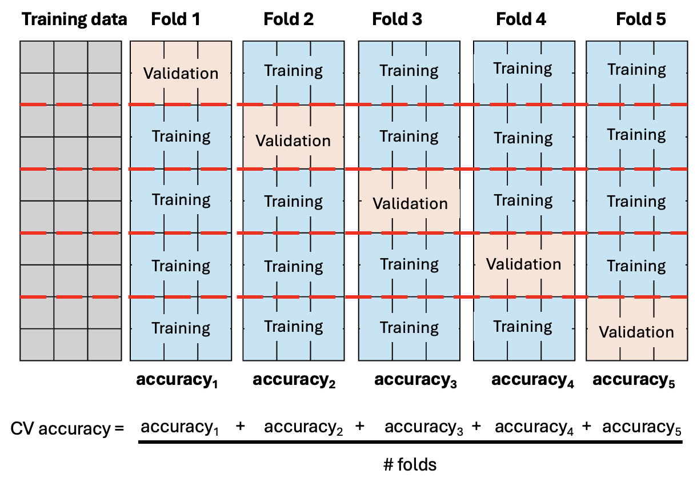
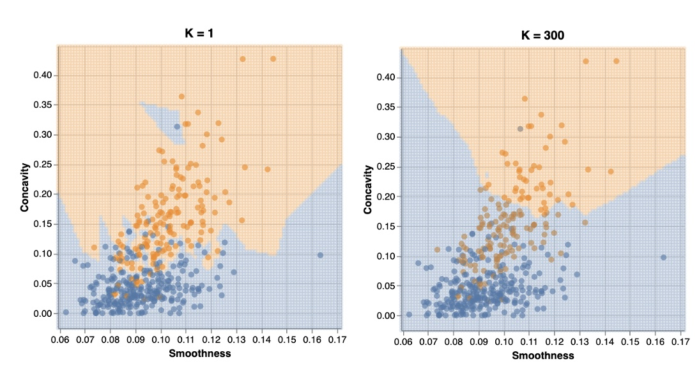

# Classification II
```console
Data Sciences Institute
Applying Statistical Concepts
```

---
##### Acknowledgements
- Slides created by Julia Gallucci under the supervision of Rohan  Alexander.
- Content adapted from: A First Introduction (Python Edition) Tiffany Timbers, Trevor Campbell, Melissa Lee, Joel Ostblom, Lindsey Heagy https://python.datasciencebook.ca/index.html
---
##### Learning objectives
- Explain training, validation, and test data sets and their roles in classification.
- Define a random seed and its importance for reproducible data analysis.
- Define and interpret accuracy, precision, recall, and confusion matrices.
- Explain underfitting and overfitting in relation to the number of neighbors in K-nearest neighbors classification.

---

##### What makes a good classifier
Provides accurate predictions on data not seen during training.

- To determine this, data is often split into a training set and a testing set
  - *Training set:* used to build the classifier
  - *Testing set:* to evaluate the performance of the classifier


**Rule: Test data cannot be used to build the model and must remain separate to provide an unbiased evaluation of the model's performance on unseen data.**

---
##### How to assess a classifier
- **Accuracy** is a good way to summarize the performance of a classifier with a single number

$$
\text{Prediction Accuracy} = \frac{\text{Number of Correct Predictions}}{\text{Total Number of Predictions}}
$$

- Accuracy can tell us how often a classifier makes mistakes, but not the kind of mistake being made
---
- **Confusion matrix** shows us how many test set labels of each type are predicted correctly vs incorrectly
  
|                | Predicted Malignant | Predicted Benign  |
|----------------|---------------------|-------------------|
| **Actually Malignant** | True Positive (TP)   | False Negative (FN) |
| **Actually Benign**    | False Positive (FP)  | True Negative (TN)  |

  - *True positive:* a malignant observation that was classified as malignant 
  - *False positive:* a benign observation that was classified as malignant
  - *True negative:* a benign observation that was classified as benign
  - *False negative:* a malignant observation that was classified as benign
---
- **Precision:** quantifies how many positive predictions the classifier made that were actually positive 

$$
\text{Precision} = \frac{\text{Number of correct positive predictions}}{\text{total number of positive predictions}}
$$


**Recall:**  quantifies how many positive observations in the test set were identified as positive 

$$
\text{Recall} = \frac{\text{Number of correct positive predictions}}{\text{total number of positive test set observations}}
$$

- A good classifier would have high precision and high recall 
- *Trade-off:* It is difficult to achieve both, models with high precision tend to have low recall and vice versa 
  - eg., perfect recall = always guess positive, but this would make lots of false positive predictions and result in low precision
---
##### Randomness and seeds
- Randomness is used in data analysis to make fair, unbiased decisions without human input.
  - Eg., helps in splitting a dataset into training and test sets to avoid bias.

- Randomness seems to conflict with the principle of reproducibility in data analysis.
- Python's random number generator uses a seed value to ensure that the sequence of random numbers is reproducible.
```python
import numpy as np
np.random.seed(123)
```
  - Setting the same seed value guarantees the same results each time the analysis is run. Different seed values result in different random patterns, but the same value ensures consistent results.

---
#### Tuning the classifier
- Most models in statistics and machine learning have parameters.
- Parameters are numbers set in advance that influence model behavior.
  - Eg. In K-nearest neighbors, $k$ is a parameter determining the number of neighbors to consider for classification.
---
#### Key parameters for KNN
For the K-Nearest Neighbors (KNN) algorithm, here are *some* key parameters that can affect accuracy:

1. **Number of Neighbors (K):** The most critical parameter in KNN is the number of neighbors to consider when making a prediction. A small k might make the model sensitive to noise, leading to overfitting, while a large k might smooth out predictions too much, leading to underfitting (*see slide 16-17*).

2. **Distance Metric:** KNN uses a distance metric (e.g., Euclidean, Manhattan, or Minkowski) to calculate the similarity between points. The choice of distance metric can significantly impact the model's performance, as different metrics may capture different aspects of the data's structure.

---
#### Choosing the Best Parameter Value
- Goal: Tune the model to maximize accuracy on *unseen data.*
- Split the training data into two subsets:
  - Training Set: Used to train the model.
  - Validation Set: Used to evaluate model performance.
  
Procedure for Parameter Tuning:
1. Split training data into two subsets.
2. Train the model on the training subset.
3. Evaluate model accuracy on the validation subset.
4. Repeat with different parameter values to find the best one.

**Important: Do not use the test set during tuning. 
Tuning is part of model training, not model evaluation.**

---
#### Cross-validation
 - Create multiple classifiers by varying parameter values and splitting the training data into multiple subsets or "folds."
 - Evaluate each classifier on validation results to determine the best parameter value.
 - Instead of random splits, use a more systematic approach where each observation is in a validation set only once.
   1. Split the training data into $C$ evenly sized chunks.
   2. Iteratively use one chunk as the validation set and the remaining $C-1$ chunks as the training set.
- This ensures that each observation is used for validation exactly once and for training $C-1$ times.
--- 

- We can choose the number of folds ($C$) and typically, the more we use the better accuracy estimate will be.
- Here, $C = 5$, different chunks of the data are used, resulting in $5$ validation sets; this is $5-fold$ cross validation
---
#### Parameter value selection
- We can use cross-validation to calculate accuracy for each value of a given parameter.
- By assessing a reasonable range of values, we can identify the parameter that yields the best accuracy.
- The optimal value is chosen based on the highest accuracy obtained during cross-validation.

---

### Question

In KNN, what happened if you set $K=1$? How about you set $K=$ total size of the training set?

---

#### Underfitting and Overfitting

- **Underfitting:**
  - Occurs when the classifier is too simplistic and fails to capture the underlying patterns in the data.
  - The model under fits the data when it isn't sufficiently influenced by the training data, resulting in poor performance on both the training and test data.
- **Overfitting**
  - Occurs when the classifier becomes too complex and fits the noise in the training data rather than the underlying pattern.
  - The model overfits the data when it is overly influenced by the training data, resulting in poor generalization to new, unseen data.

*Both overfitting and underfitting lead to a model that does not generalize well to new data!*

---

-  If $K$ = total size of the training data set, the classifier will predict the same label for all new observations, regardless of their characteristics.
- If $K =1$, the classifier matches each new observation to its closest neighbor, leading to a highly sensitive and unreliable model.

---
#### Summary

- To tune and evaluate a classifier, the data is split randomly into a training set and a test set.
- The training set is used to build the classifier.
- The classifier can be tuned, such as by selecting the optimal number of neighbors in KNN, by maximizing estimated accuracy through cross-validation.
- After tuning, the test set is used to estimate the classifier's accuracy on unseen data.

---
## `Putting it all together`
### `KNN pt 2 with scikit-learn`