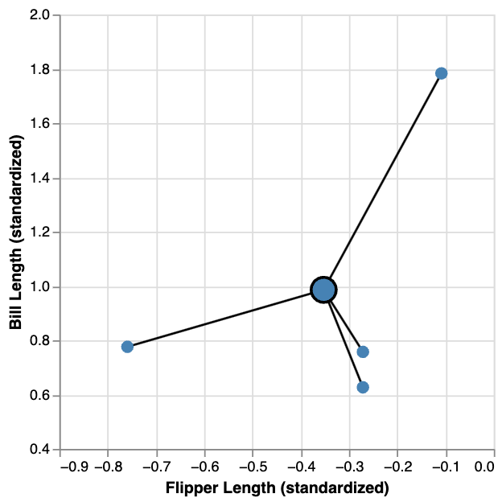
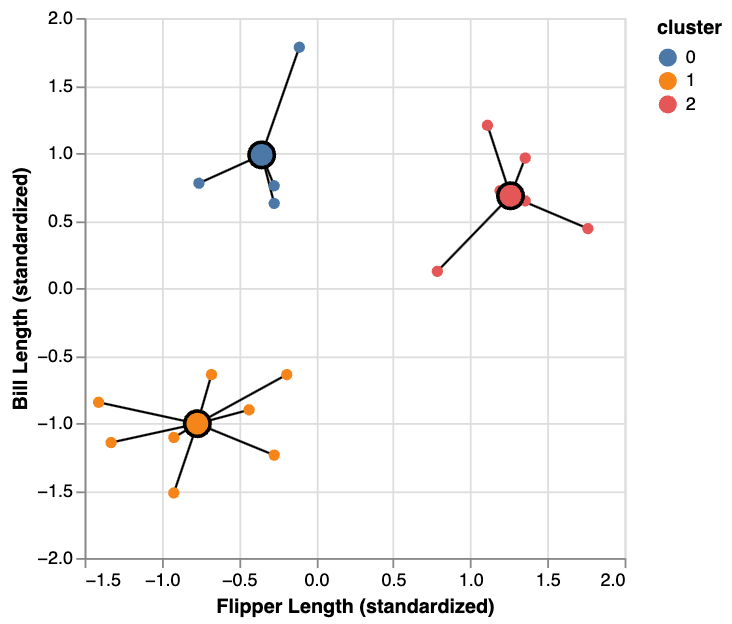
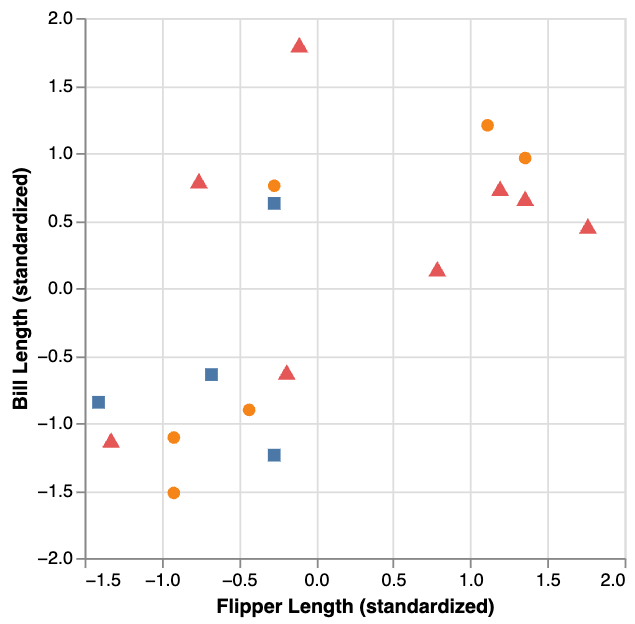
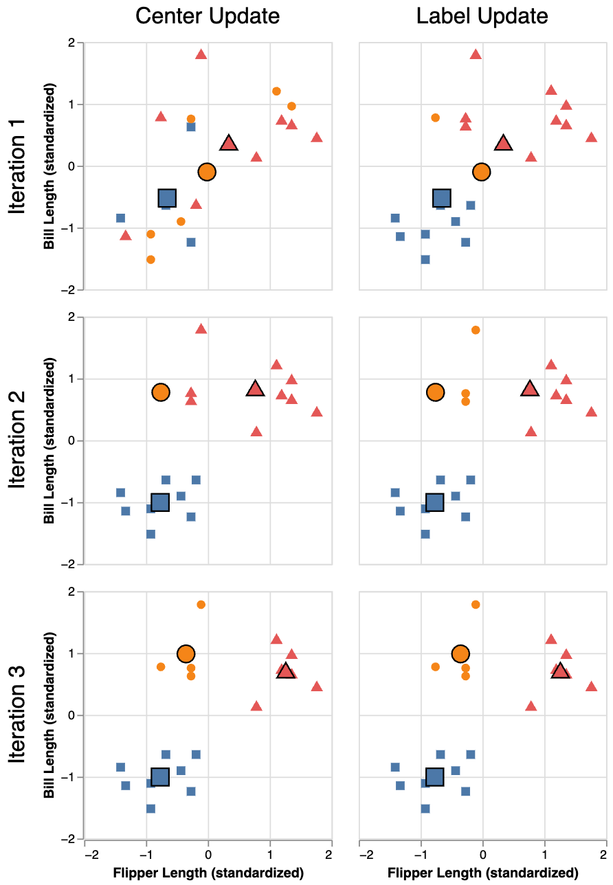
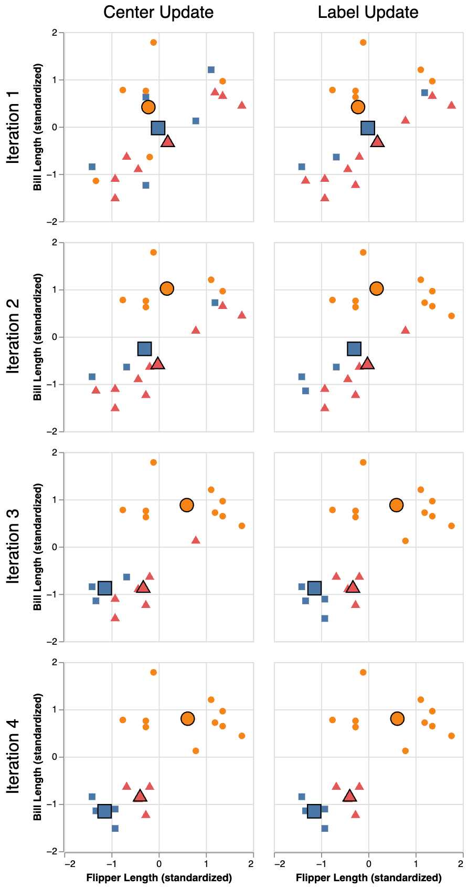
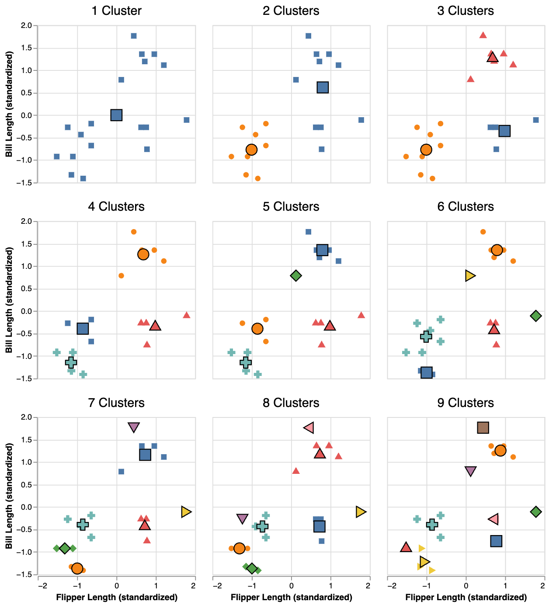
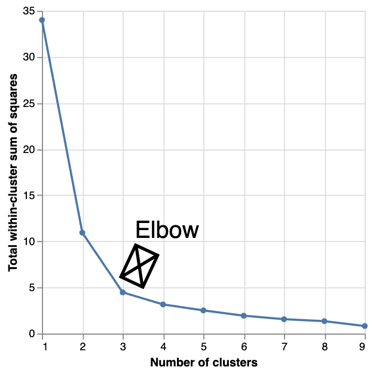

# Clustering
```console
Data Sciences Institute
Applying Statistical Concepts
```

---
##### Acknowledgements
- Slides created by Julia Gallucci under the supervision of Rohan  Alexander.
- Content adapted from: A First Introduction (Python Edition) Tiffany Timbers, Trevor Campbell, Melissa Lee, Joel Ostblom, Lindsey Heagy https://python.datasciencebook.ca/index.html
---
##### Learning objectives
  - Identify when clustering is appropriate and the insights it provides.
   - Explain the K-means clustering algorithm.
   - Differentiate between clustering, classification, and regression.
 - Implement K-means clustering in Python using scikit-learn.
  - Apply the elbow method to determine the optimal number of clusters.
   - Interpret and visualize K-means clustering results.


---
##### The clustering problem
- Clustering involves separating a dataset into subgroups of related data.
- Examples of clustering applications:
  - Grouping documents by topics.
  - Categorizing human genetic information by ancestral subpopulations.
  - Segmenting online customers by purchasing behaviors.
- Clustering is used often for exploratory analysis to uncover patterns in the data.

---
##### Clustering vs. Classification/Regression
- Clustering is an unsupervised task *without a response variable.*
- Classification and regression are supervised tasks *with response variables* (labels or values) based on past data to predict future outcomes.

| **Advantages**               | **Disadvantages**                                   |
|------------------------------|-----------------------------------------------------|
| No need for labeled data.   | No straightforward way to evaluate clustering quality. |

- Unlike classification, which can use a test dataset for performance evaluation, clustering lacks a definitive evaluation method.
  - Visualization is often used to assess clustering quality

---


##### Real world example

| **Clustering**                                                                                         | **Classification**                                                                                      |
|--------------------------------------------------------------------------------------------------------|--------------------------------------------------------------------------------------------------------|
| Imagine you have lung scans and *don’t know which ones show cancer*. We can group scans with similar features, like unusual spots or patterns, to identify potential cases. This helps in spotting scans that may need further investigation, even without knowing what cancer looks like beforehand. | Now, if you *already know which scans are cancerous*, we can use classification to train a model to label new scans as either "cancerous" or "not cancerous" based on that known data.

**Key point: Classification assigns labels based on predefined examples, while clustering groups data without prior labels.**


---
##### K-means
- Various clustering methods exist, with **K-means** being the focus of this module.
- Other clustering techniques include hierarchical clustering, principal component analysis, and multidimensional scaling.

- **K-means** is a clustering algorithm that partitions data into $K$ distinct groups by iteratively updating cluster centers and reassigning data points to minimize the within-cluster sum of squared distances.

---
##### Example dataset
 - the palmerpenguins is the dataset we will be using, specifically to determine whether there are distinct types of penguins in our data. 
- Key features:
  - 18 observations (rows)
  - Two variables (penguin bill and flipper length)

---
##### Data Visualization
- Data visualization is a helpful tool for identifying patterns when dealing with a small number of variables. However, to group data and determine the number of groups in a reproducible way, we need a more automated approach. 
- Visualization alone becomes less effective as the number of variables increases. To rigorously group data, we can use a clustering algorithm like K-means.

---

Visualizing the relationship between flipper length and bill length, we can observe what appear to be three distinct subtypes of penguins in the dataset:
- A group with small flipper length and small bill length.
- A group with small flipper length but large bill length.
- A group with large flipper length and large bill length.

---
##### Cluster quality
- The K-means algorithm groups data into $K$ clusters.
- It begins with an initial clustering of the data (this is done randomly).
- The algorithm iteratively refines the clustering by reassigning data points to clusters.
- The process continues until no further improvements can be made.
- The "quality" of clustering is measured by the within-cluster sum-of-squared-distances (WSSD), also known as inertia.
---
##### WSSD
  1. Calculate the cluster centers by taking the mean of each variable for all data points in a cluster.
  For example, suppose we have a cluster containing 4 observations, and we are using two variables, $x$ and $y$ , to cluster the data. Then we would compute the coordinates, $\mu_x$ and $\mu_y$ of the cluster center by
  $$
  \mu_x = \frac{1}{4}(x_1+x_2+x_3+x_4) \quad \mu_y = \frac{1}{4}(y_1+y_2+y_3+y_4)
  $$
---
##### WSSD
2. Measure the sum of squared distances between each data point and its cluster center.

WSSD is computed by summing the squared Euclidean distances between each data point and the cluster center.
$$
\begin{split}
\text{WSSD} = \left((x_1 - \mu_x)^2 + (y_1 - \mu_y)^2\right) + \left((x_2 - \mu_x)^2 + (y_2 - \mu_y)^2\right)\\
 + \left((x_3 - \mu_x)^2 + (y_3 - \mu_y)^2\right)  +  \left((x_4 - \mu_x)^2 + (y_4 - \mu_y)^2\right)
\end{split}
$$
---

##### WSSD
- A larger WSSD indicates that the cluster is more spread out, as it means data points are farther from the cluster center.

- To obtain the total WSSD, sum the WSSD values for all clusters, which involves adding up all squared distances for all observations.


---

##### Clustering algorithm
- The K-means algorithm starts by choosing $K$ and randomly assigning observations to each of the $K$ clusters. 
- Here, each data point is assigned to 1 of 3 clusters:
  1. orange circle
  2. red triangle
  3. blue square
  
  

---
 K-means involves two iterative steps to minimize the total WSSD:
  1. **Center update**: Compute the center of each cluster.
  2. **Label update**: Reassign each data point to the cluster with the nearest center.
- These steps are repeated until cluster assignments stabilize.
---

- Figure depicts the first 3 iterations

- The K-means algorithm can terminate when no assignments change, as observed in the **third iteration where both cluster centers and labels remain the same.**
  - The total WSSD will eventually stop decreasing, indicating no further changes in assignments, leading to the termination of the algorithm.

---
##### Random restarts
- Unlike classification and regression models, K-means can get “stuck” in a suboptimal solution due to poor initializations.
- Figure illustrates the first 4 iterations of K-means with this poor initialization, showing how the clustering evolves with each iteration (center updates and label reassignments).


---
- Poor clustering indicates that K-means cannot improve further from the initialization.
- To address this issue, we can:
  - Randomly reinitialize the cluster labels multiple times.
  - Run K-means for each initialization.
  - Select the clustering result with the lowest final total WSSD.

---
##### Choosing K
- In K-means clustering, selecting the number of clusters, $K$, is crucial. Unlike classification, we lack a response variable and can't use cross-validation to measure prediction error.

  - **Too small $K$**: Results in merging distinct groups, leading to a high total WSSD because cluster centers are far from data points.
  - **Too large $K$**: Leads to excessive subdivision of data, reducing total WSSD but only slightly after a certain point.

---

- Figure depicts clustering results for $K$ values ranging from 1 to 9, with cluster centers highlighted. 
  
---

- The total WSSD versus the number of clusters, often showing an "elbow" shape indicating the optimal number of clusters where the WSSD decrease levels off.

---
## `Putting it all together`
### `K-means with scikit-learn`
