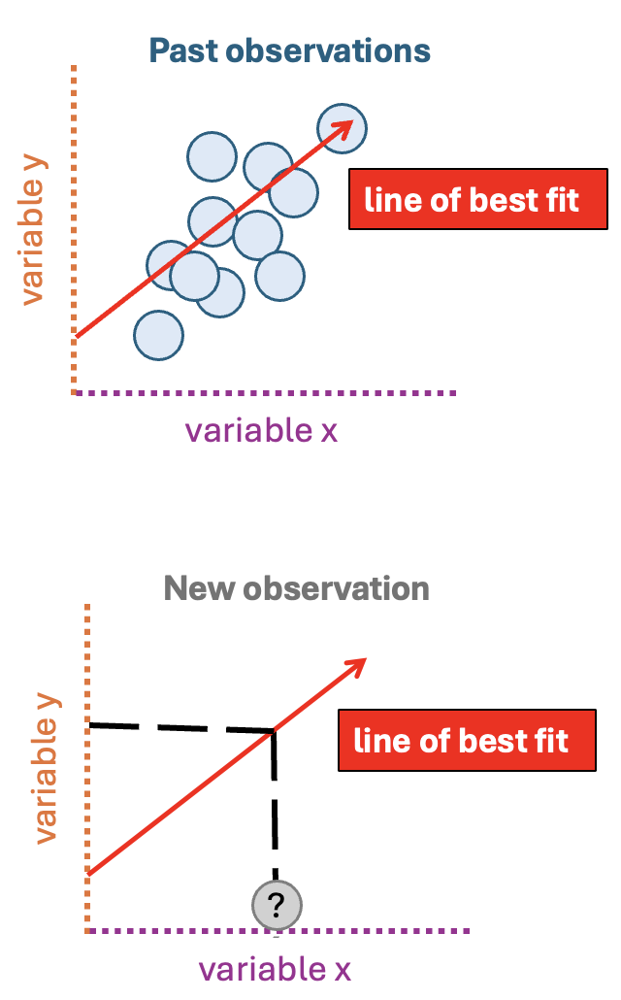
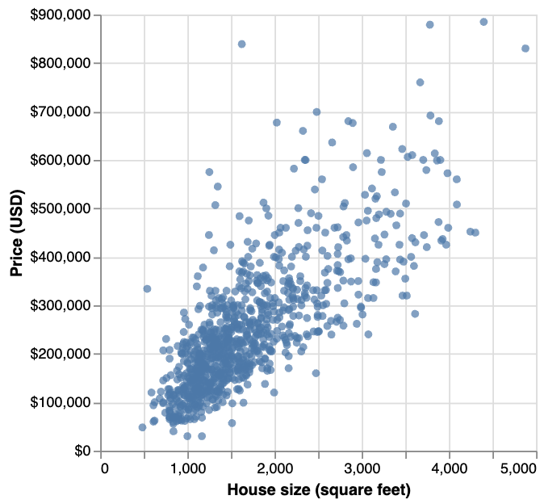
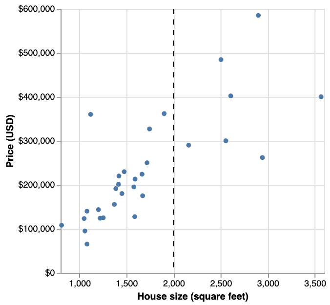
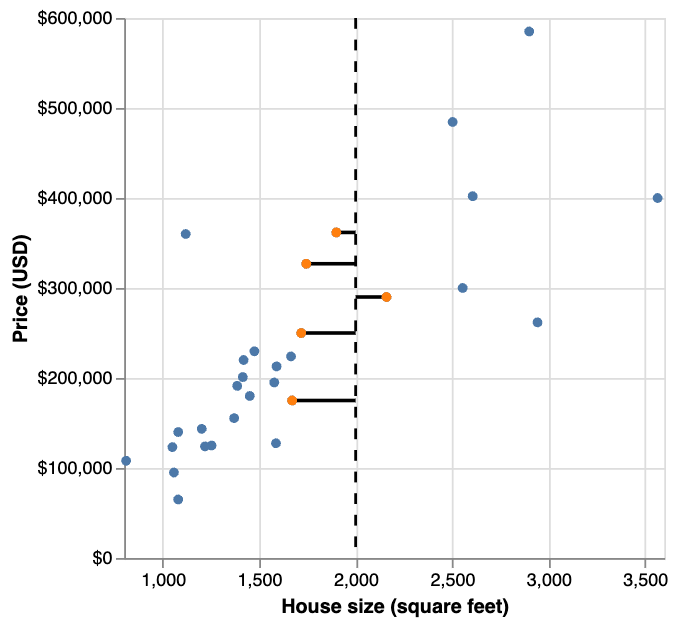
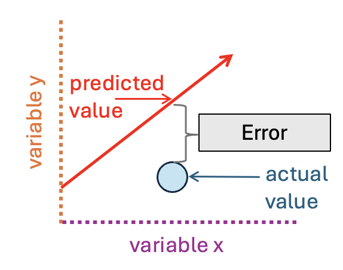
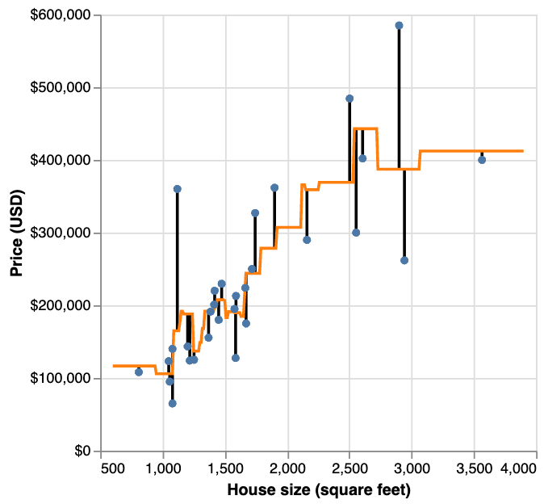
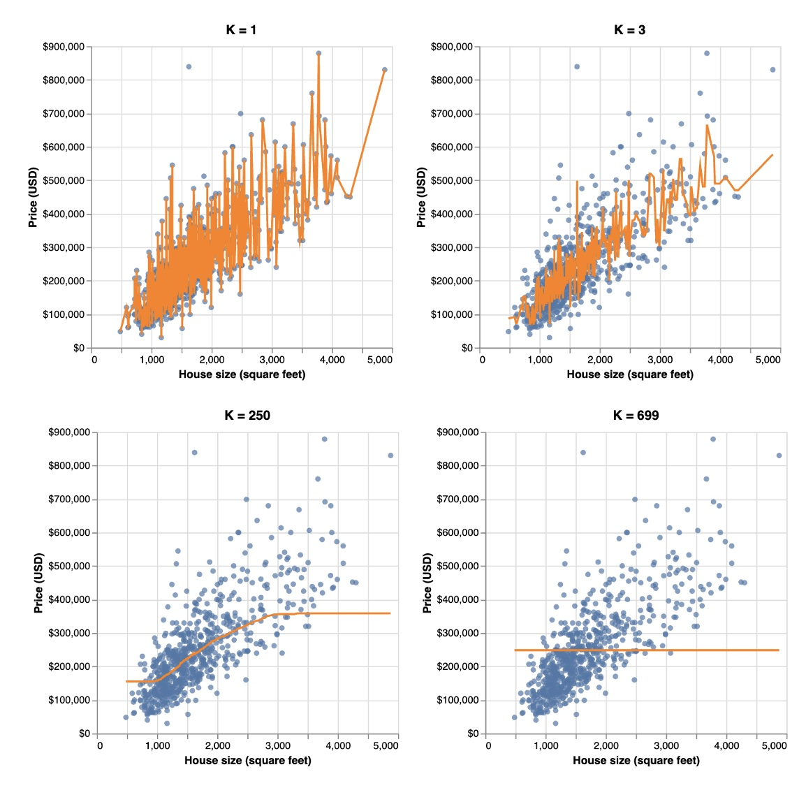
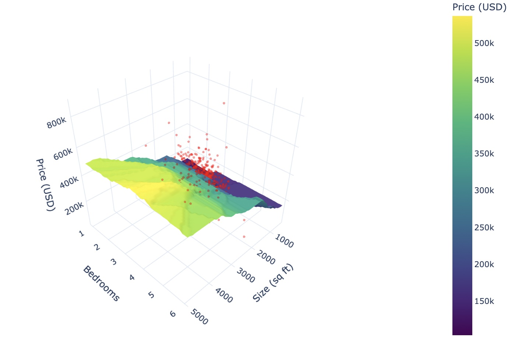

# Regression I
```console
Data Sciences Institute
Applying Statistical Concepts
```
---
##### Acknowledgements
- Slides created by Julia Gallucci under the supervision of Rohan  Alexander.
- Content adapted from: A First Introduction (Python Edition) Tiffany Timbers, Trevor Campbell, Melissa Lee, Joel Ostblom, Lindsey Heagy https://python.datasciencebook.ca/index.html
---
##### Learning objectives
- Identify when to use regression for predictions
- Explain the KNN regression algorithm and contrast it with KNN classification.
- Interpret KNN regression results.
- Implement K-nearest neighbors regression in Python with scikit-learn.
- Explain underfitting, overfitting, and their relation to neighbor count in KNN regression.

---
#### The regression problem
- Uses one or more variables (x's) to predict a numeric value of interest (response variable; y)
  - Eg., we could try to use the size of a house to predict its sale price.

- The regression model predicts a new observation’s response variable based on finding a pattern in data set of past observations and drawing a **line of best fit** through it.
  

---
#### Building a regression model

1. Split the data into training and test sets, in order to ensure that we assess the performance of our method on observations not seen during training. 
2. Use cross-validation to evaluate different choices of model parameters (e.g., K in a KNN model). 

---
 ##### Example dataset
932 real estate transactions in Sacramento, California is the dataset we will be using, specifically for predicting whether the size of a house in Sacramento can be used to predict its sale price. 

- *Key features:* 
  - 932 observations (rows)
  - predictor of interest (sqft; house size, in livable square feet)
  - response variable of interest (house sale price, in USD)
---
- Visualizing the relationship between house size (predictor) and sale price (response) shows that as the size of a house increases, its sale price generally rises as well. 
- This suggests that we could potentially predict the sale price of a house based on its size, even if the house hasn't been sold yet.



---
 ##### KNN Regression
 - To decide whether the $350,000 asking price for the 2,000 square-foot house in Sacramento is fair, we can use our existing data to predict its likely sale price. 
 - However, since there are no exact observations for a 2,000 square-foot house in our dataset, we need a method to estimate the price. 
 - One approach is to use a predictive model, such as **KNN regression**, to predict the sale price based on the prices of houses with similar sizes in the dataset. 

---
#### K = 5 (5 Nearest-neighbours)
- We can find the 5 houses in our dataset that are closest in size to 2,000 square feet—these are our 5 nearest neighbors. By **calculating the mean of the sale prices for these 5 nearest neighbors**, we can estimate the likely sale price of the 2,000 square-foot house.
  
---
#### Tuning the model
- How do we choose the optimal $K$, and how can we evaluate whether our model is effective at making predictions? 
- Unlike in KNN classification, where accuracy measures how well predictions match true labels, in KNN regression, our predictions rarely match the exact values of the response variable.
- Instead, we'll evaluate our model using the **root mean square prediction error (RMSPE).**
  - RMSPE tells us how far off our predictions are, on average. It’s a way to see how accurate our model is at making predictions. 
- In cross-validation, we select the value of $K$ that *minimizes* RMSPE
- The **smaller the RMSPE, the closer our predictions are to the actual values.**

---
#### RMSPE


1. **Find the Error:** For each prediction, subtract the predicted value from the actual value. This gives you the error for each prediction.

2. **Square the Errors:** Square each of these errors. This makes sure all the errors are positive, and bigger errors have a bigger impact.

3. **Find the Average:** Calculate the average of these squared errors.

4. **Take the Square Root:** Finally, take the square root of that average to get the RMSPE.
  

---
The **orange line** represents the predicted prices for various house sizes based on the KNN regression model.
The **vertical lines** extend from each observed point to the orange line, representing the error between the true sale price and the predicted price.
  

---
#### Underfitting and Overfitting
- By setting the number of neighbors to be too small or too large, we cause the RMSPE to increase.
  -  Eg. If **K is very large,** the orange line becomes very smooth or even flat, as predictions are based on many observations, or in the extreme case, the entire dataset. This **leads to underfitting, where the model is too simplistic and ignores important trends in the data.**
   - In cases **where K=1,** the orange line closely follows the training data, as predictions rely on just one observation. This causes **overfitting, where the model is overly influenced by the specific dataset and fails to generalize to new data.**

The ideal model strikes a balance: it captures the overall trend without being swayed by noise in the data. 

---
  

---


---
#### Multivariable KNN regression
- The same KNN algorithm applies when you have multiple predictor variables. 
- *Caution: the scale of each variable affects predictions, consider processing your data.*
-  Variables that are on a large scale will have a much larger effect than variables on a small scale.
  

---
## `Putting it all together`
### `KNN regression with scikit-learn`
