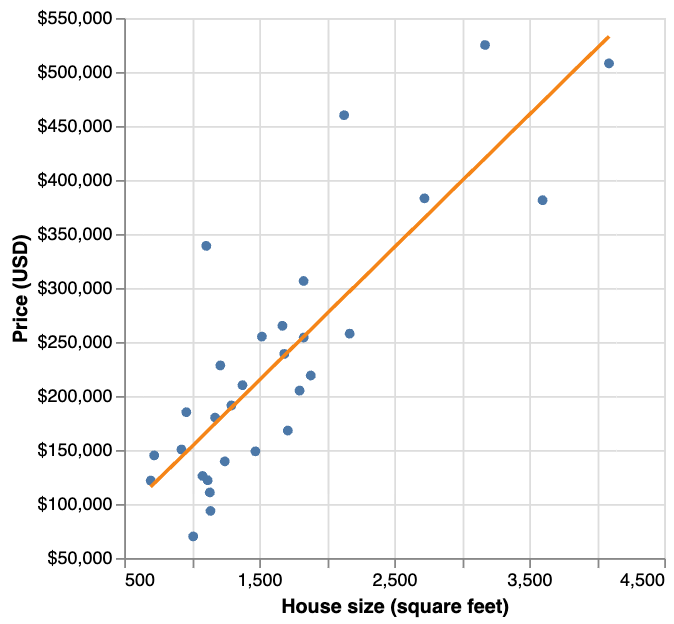
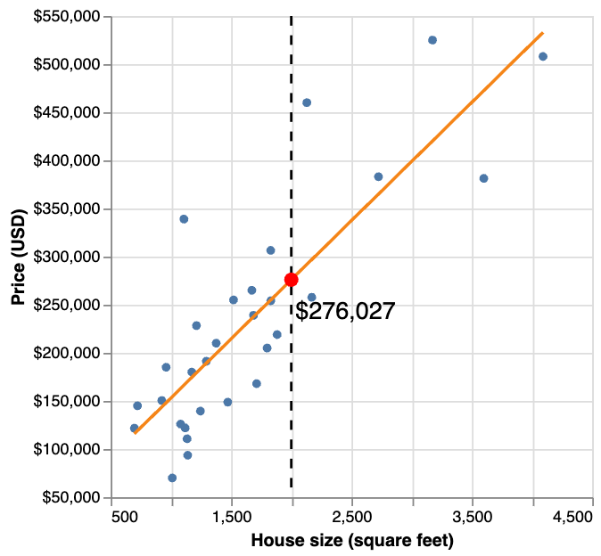
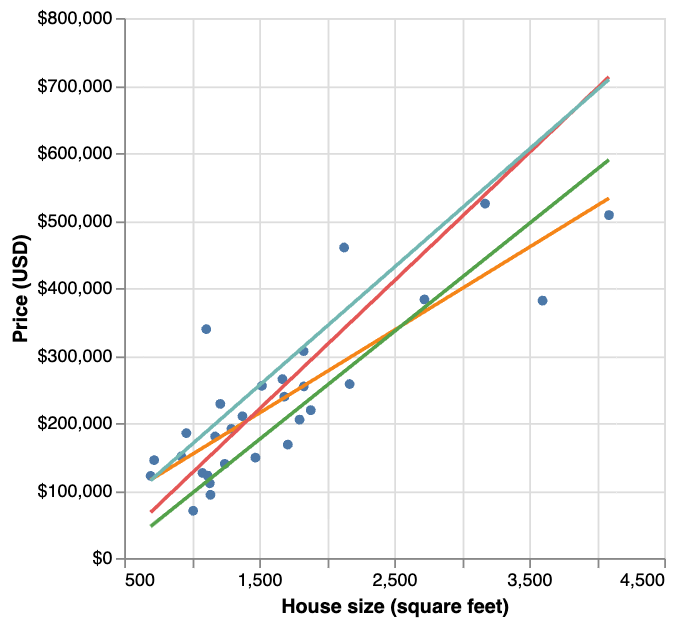
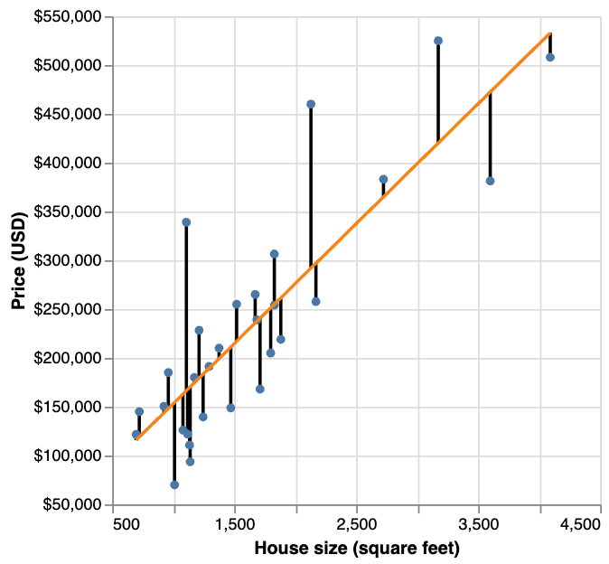
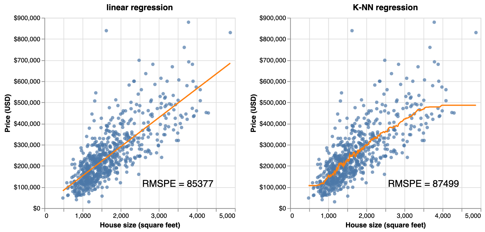
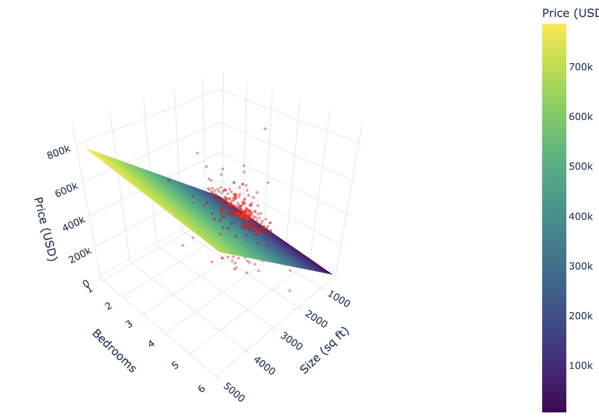
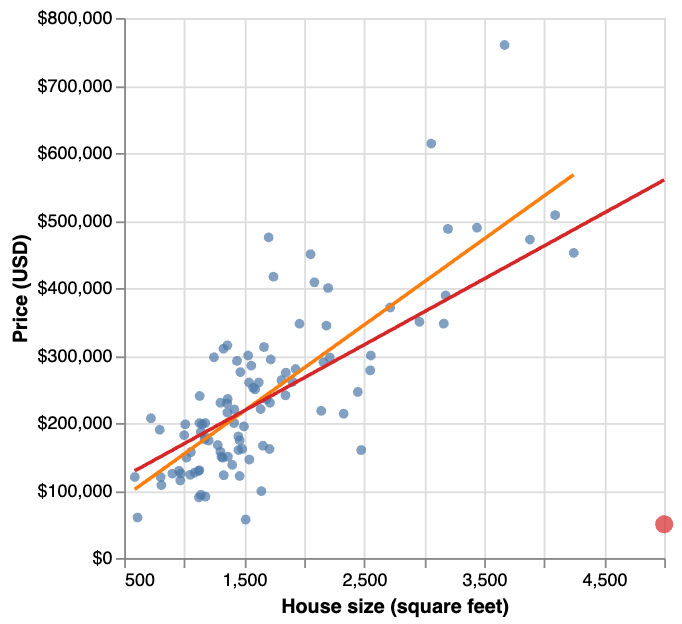
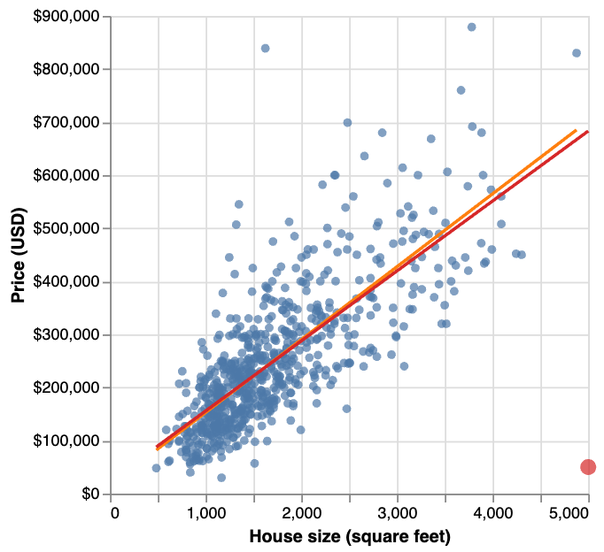
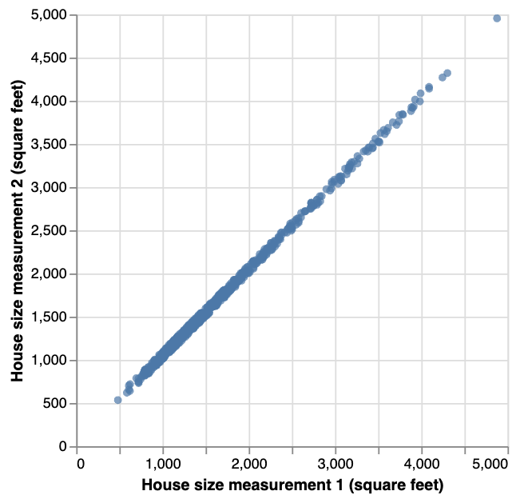

# Regression II
```console
Data Sciences Institute
Applying Statistical Concepts
```
---
##### Acknowledgements
- Slides created by Julia Gallucci under the supervision of Rohan  Alexander.
- Content adapted from: A First Introduction (Python Edition) Tiffany Timbers, Trevor Campbell, Melissa Lee, Joel Ostblom, Lindsey Heagy https://python.datasciencebook.ca/index.html

---
##### Learning objectives
- Explain the linear regression algorithm and contrast it with KNN regression.
- Fit simple and multivariable linear regression models on training data using Python.
- Evaluate the linear regression models on test data.
- Explain the impact of outliers and multicollinearity on linear regression.

---
##### Simple linear regression
$$ y = mx + b $$
- **Predictor Variable ($x$)**:
  - The factor you’re using to make the prediction (independent variable)

- **Response Variable ($y$):**
  - The outcome or result you’re trying to predict (dependent variable)

- **Slope of the line ($m$)**: 
  - How much $y$ changes when $x$ changes.

- **Y-intercept ($b$)**:
  - The starting value of $y$ when $x$ is 0.
---

- KNN regression has limitations: poor prediction beyond the training data range and slower performance with larger datasets.
- Linear regression addresses these limitations: better prediction range and faster performance with larger datasets.
- Linear regression is widely used due to its interpretable mathematical equation linking predictors and response variables.
- Simple linear regression involves one predictor and one response variable and **predicts by creating a straight line of best fit through the training data.**

---
 ##### Example dataset
932 real estate transactions in Sacramento, California is the dataset we will be using, specifically for predicting whether the size of a house in Sacramento can be used to predict its sale price. 

- *Key features:* 
  - 932 observations (rows)
  - predictor of interest (sqft; house size, in livable square feet)
  - response variable of interest (house sale price, in USD)
---
- To decide whether the $350,000 asking price for the 2,000 square-foot house is fair, we can use our existing data to predict its likely sale price. However, since there are no exact observations for a 2,000 square-foot house in our dataset, we need a method to estimate the price. 
- Using simple linear regression, we use the data we can draw a straight line of best fit through our existing data points.


---
- The equation for the straight line in simple linear regression is:
  
  
$$
\text{house sale price} = \beta_0 + \beta_1 \text{house size}
$$

  where:
 $\beta_0$ is the vertical intercept (price when house size is 0).
  $\beta_1$ is the slope (rate of price increase as house size increases).
  

- Finding the line of best fit involves determining coefficients $\beta_0$ and $\beta_1$ that define the line.
  - $\beta_0$ represents the "base price,"  
  - $\beta_1$ is the price increase per square foot.

---
- Once we have the coefficients, we can use the equation to evaluate the predicted sale price given the value we have for the predictor variable—here 2,000 square feet.
- Linear regression can predict extreme values (e.g., 6 million or -2,000 sq. ft.), but these predictions are unreliable.
- Make predictions within the original data range; extrapolate only when logically justified.


---
 ##### Choosing the line of best fit
 Many different lines could be drawn through the data points, how do we choose the line of best fit? 


---
- Simple linear regression finds the line of best fit by minimizing the average squared vertical distance between the line and observed data points.
- This process is equivalent to **minimizing the Root Mean Squared Error (RMSE).**
- The predictive accuracy of the simple linear regression model is assessed using the Root Mean Squared Prediction Error (RMSPE), similar to KNN regression.


---
#### Comparing simple linear and KNN regression
- **Parameter Tuning:** No need for cross-validation to choose parameters in linear regression.
- **Data Preparation:** No need for standardization (centering and scaling) of the data in linear regression.
---

Visualization of the simple linear regression model predicting price from house size and the “best” K-NN regression model obtained from the same problem.

--- 
|                | **Simple Linear Regression**                                 | **KNN Regression**                                  |
|---------------------------|--------------------------------------------------------------|------------------------------------------------------|
| **Line Shape**            | Straight line                                                | Flexible, wiggly line                              |
| **Interpretability**      | High (defined by intercept and slope)                        | Low (no clear interpretability due to flexibility)  |
| **Fit Quality**           | May underfit non-linear relationships                       | Better fit for non-linear relationships             |
| **RMSE/RMSPE**            | Lower on linear relationships                               | Lower on non-linear relationships                   |
| **Extrapolation Behavior**| Predicts with constant slope, can be inaccurate (e.g., negative prices) | Produces flat predictions at boundaries, may not match reality |

---
#### Multivariable linear regression
- Extends simple linear regression to multiple predictors.
- Similar to KNN regression, simply add more predictors to the training data.
- Each predictor variable *may* give us new information to help create our model. 
The only difference is the formula:
$$
\text{house sale price} = \beta_0 + \beta_1 \text{house size} + \beta_2 \text{number of bedrooms}
$$

  where:
 $\beta_0$ is the vertical intercept (price when house size is 0 and number of bedrooms is 0).
  $\beta_1$ is the slope (rate of price increase as house size increases when fixing everything else).
  $\beta_2$ is the slope (rate of price increase as number of bedrooms increases when fixing everything else).

---

In the case of two predictors, we can plot the predictions made by our linear regression to create a plane of best fit.

---
#### Outliers
- Data points with unusually high or low vertical distances from the line of best fit.
- Outliers can disproportionately influence the line of best fit.
- Identifying outliers accurately often requires advanced techniques.

- Eg.,  a single outlier (a 5,000 sq. ft. house sold for $50,000) dramatically alters the line of best fit, changing it from the original (**orange**) to a new line (**red**).
  
---
Fortunately, if you have enough data, the inclusion of one or two outliers—as long as their values are not too wild— will typically not have a large effect on the line of best fit.


---
#### Multicollinearity 
- Occurs in multivariable linear regression when predictors are strongly linearly related.
- if predictors are highly correlated, the model’s coefficients can become very sensitive to slight changes in the data.
- This sensitivity can lead to large variations in the estimated coefficients when using different data splits or subsets.
- Identifying multicollinearity often requires techniques like Variance Inflation Factor that are beyond the scope of this module.


---
## `Putting it all together`
### `linear regression with scikit-learn`
