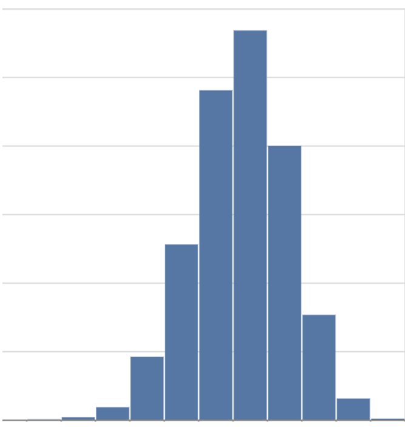
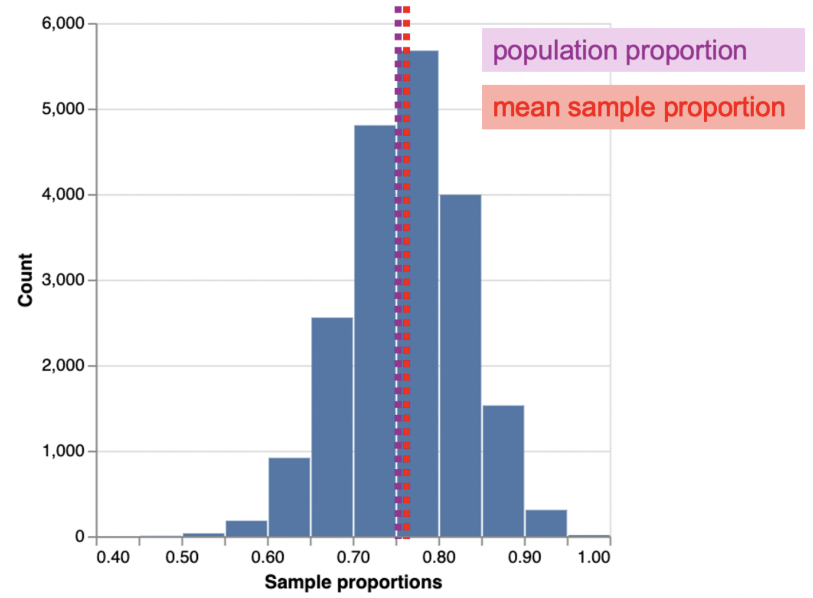
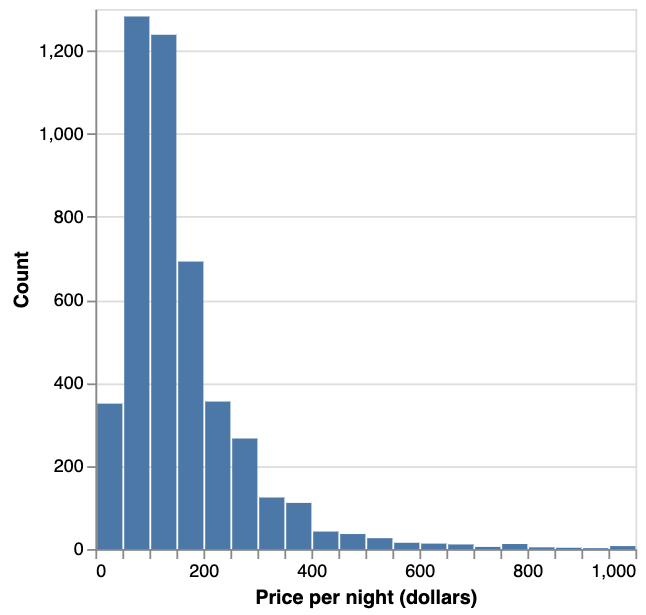
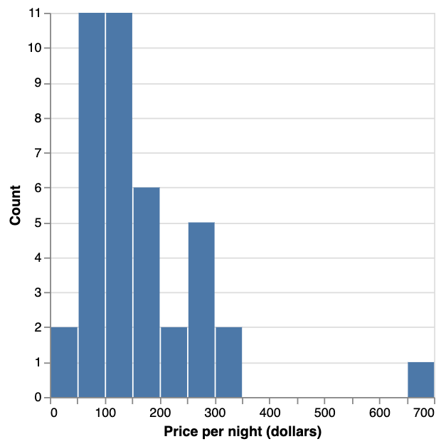
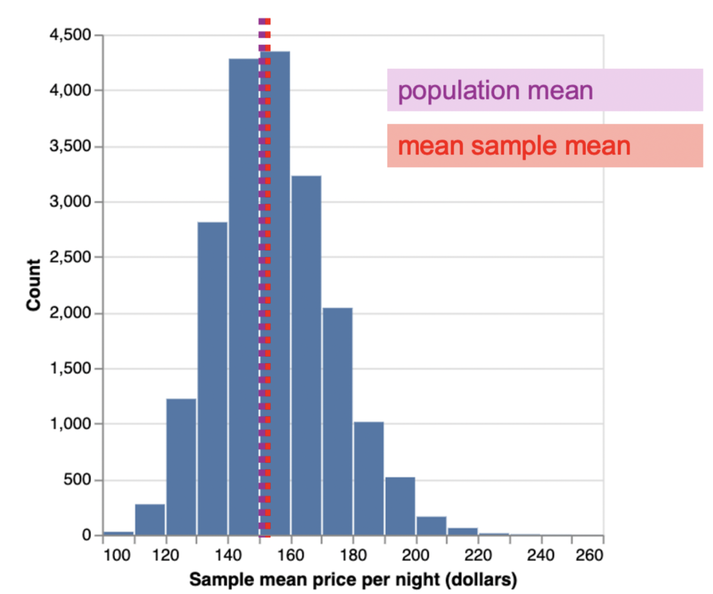
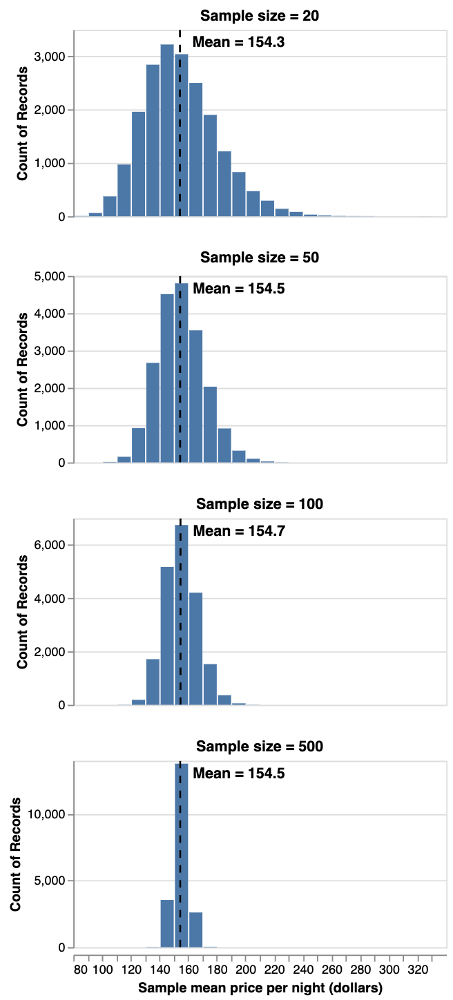
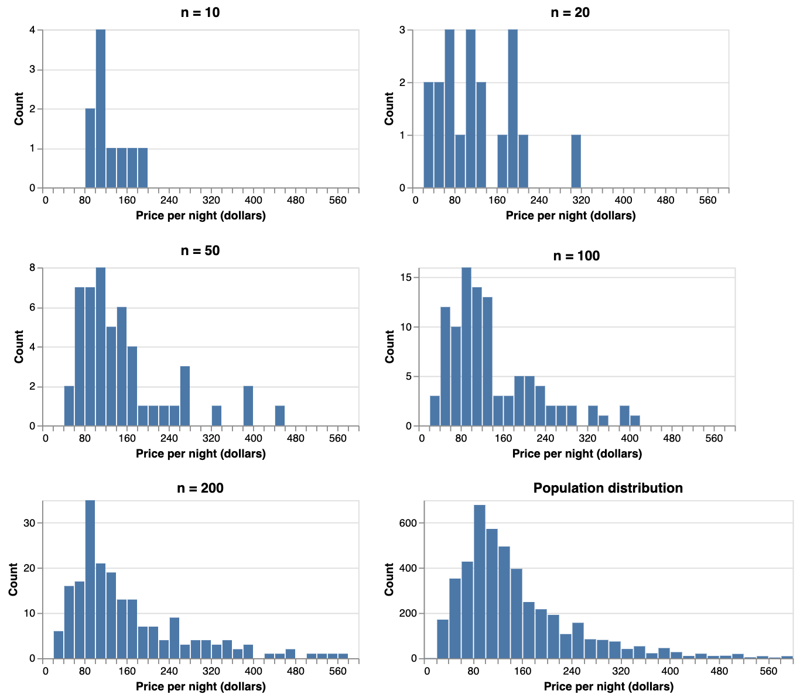
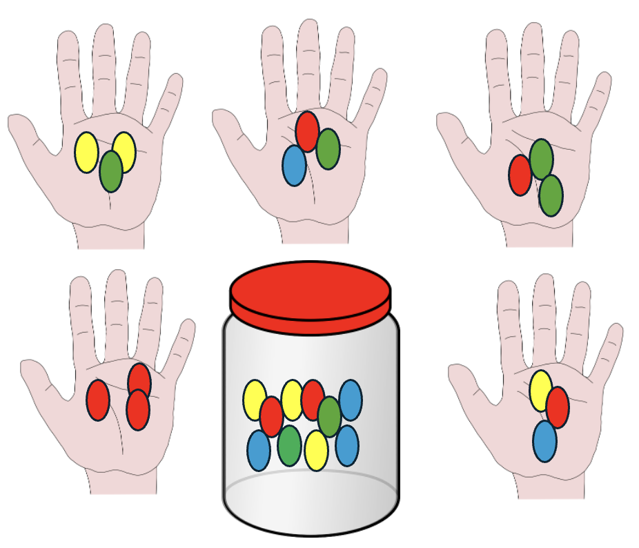
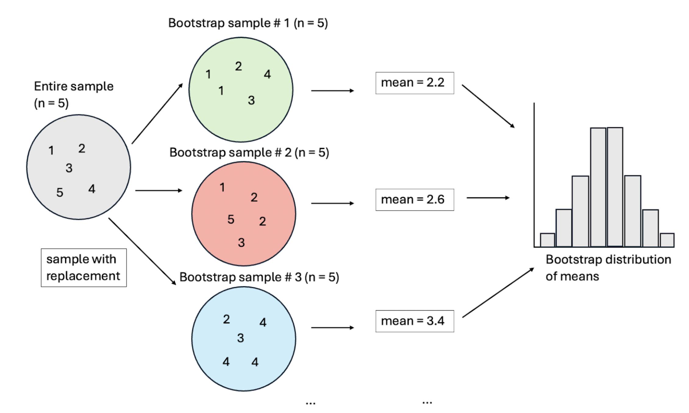
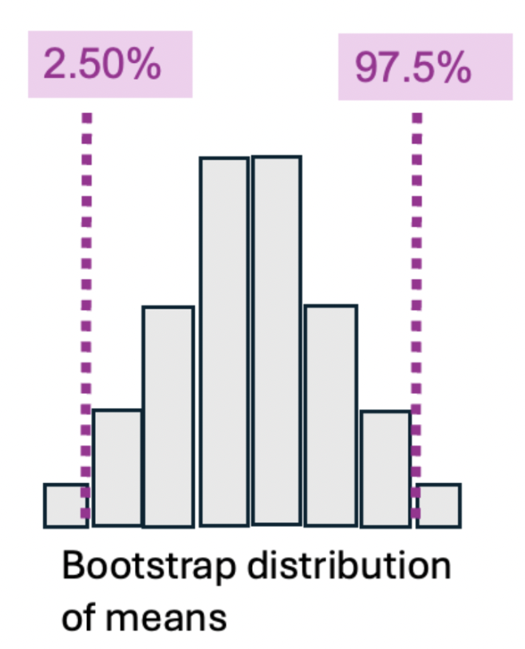

# Statistical Inference
```console
Data Sciences Institute
Applying Statistical Concepts
```

---

##### Acknowledgements
- Slides created by Julia Gallucci under the supervision of Rohan  Alexander.
- Content adapted from: A First Introduction (Python Edition) Tiffany Timbers, Trevor Campbell, Melissa Lee, Joel Ostblom, Lindsey Heagy https://python.datasciencebook.ca/index.html

---
##### Learning objectives

- Define and estimate population parameters (mean, proportion, standard deviation) from sampled data.
- Define key statistical sampling terms: population, sample, population parameter, point estimate, and sampling distribution.
- Differentiate between population parameters and sample point estimates.
- Use Python to:
   - Draw random samples and create a sampling distribution from a finite population.
   - Explore the impact of sample size on the sampling distribution.
   - Implement bootstrapping to approximate a sampling distribution.
  - Compare bootstrap and sampling distributions.

---
##### Why do we need sampling?
- We often want to understand how observed data from a subset relates to the broader population.
  - Example: A retailer wants to estimate the market for iPhone accessories on North American college campuses.
  - Question: What proportion of North American undergraduate students own an iPhone?
- **Population**: The complete group of individuals we are interested in (e.g., all undergraduate students in North America).
- **Population parameter**: A numerical characteristic of the entire population (e.g., the proportion of iPhone owners).

---
- Computing population parameters directly is often impractical, time-consuming, or costly.
- Instead, we use a **sample**, a subset of the population, to estimate the population parameter.
- **Sample estimate**: A numerical characteristic of the sample that approximates the population parameter.
- **Statistical inference**: Using a sample to make conclusions about the broader population.


---
##### Example dataset
- Data from Inside Airbnb listings in Vancouver from September 2020.
- The dataset includes:
  - ID number
  - Neighborhood
  - Type of room
  - Number of people accommodated
  - Number of bathrooms, bedrooms, and beds
  - Price per night

---
##### Categorical variable of interest example (proportion)
- Suppose the city of Vancouver wants data on Airbnb rentals to help plan city bylaws.
- They aim to estimate the proportion of Airbnb listings categorized as "entire home or apartment" (as opposed to private or shared rooms).
- Although true population data is typically unavailable, for learning, we assume our dataset represents the full population of Airbnb listings in Vancouver.
- In real data analysis, this population parameter is usually *unknown*, as measuring the entire population is often impractical.

---
- To approximate this parameter, we can take a small subset of data.
- For example, lets say we randomly select **40** listings from the population and compute the proportion of "Entire home or apt" listings within this sample.
- The proportion of "Entire home or apartment" listings in the **random sample is 0.725**, which is close to the true **population value of 0.747**.
- This proportion is an estimate (point estimate) of the population parameter based on the sample.

- Due to the randomness of the sample, repeating the process with another random sample of size 40 may yield a different proportion.
- Different random samples yield varying estimates, showing sampling variability.

---
- To assess how much sample estimates vary, we could pull many samples (e.g., 20,000) of size 40 from the population and calculate the proportion of "Entire home or apartment" listings for each sample.
- We can then visualize the distribution of these sample proportions using a histogram, which represents the **sampling distribution**.
- The sampling distribution helps us understand the expected *variability* in sample proportions for a sample size of 40.


---
Here, we see the sampling distribution is bell-shaped 🔔, symmetric, and centered around 0.75, with sample proportions ranging from approximately 0.55 to 0.95. The mean of the sample proportions is 0.748, which is close to the population proportion of 0.747.
- This indicates that the sample proportion is a **good estimator of the population proportion**, with no consistent tendency to overestimate or underestimate it.



---
##### Numeric variable of interest example (mean)
- Suppose a traveler wants to estimate the average price per night of an Airbnb in Vancouver. A histogram can visualize the distribution of these prices.

- Here, we see a skewed  distribution with one peak, where most Airbnb listings are *under $250 per night*, but a few high-cost listings create a long tail on the right side;  population mean represents the average price per night.


---
- If we didn’t have access to the population data (which is usually the case), we could estimate the mean price by taking a **sample** of as many listings as time and resources allow. Suppose we could sample 40 listings. 
- The average value of the sample of size 40 is $153.48. This number is a **point estimate** for the population mean. The actual population mean was $154.51, so our estimate was fairly close!


---
**Note:** in practice, we usually can't compute the accuracy of our estimate because we don't have access to the population parameter; if we did, there would be no need to estimate it!
- It's also important to remember that point estimates can vary. If we took another random sample, the estimate might change. 
Since we have access to the population data, we can explore this by taking many samples and plotting the **sampling distribution of sample means**. 

---

- In this case, we'll can use 20,000 samples of size 40 and consider the sample mean for each, then plot the sampling distribution of these means.

- Here, the sampling distribution of the mean is bell-shaped 🔔 with a single peak. Most estimates fall between $140 and $170.

---
##### How do we improve our point estimate?

- Given the significant variation in the sampling distribution of the sample mean—indicating that our point estimate might not be very reliable—is there a way to improve the estimate?
- One effective approach is to take a **larger sample.**

---
If we took multiple samples of sizes 20, 50, 100, and 500, then plot the sampling distribution of the sample mean for each, we’d see:
1. The mean of the sample means (across samples) is equal to the population mean, meaning the sampling distribution is centered at the population mean.
2. Increasing the sample size decreases the spread (variability) of the sampling distribution, leading to a more reliable point estimate of the population parameter.
3. The distribution of the sample mean is approximately bell-shaped 🔔.


---
**Key Point: A large enough sample should resemble the population distribution.**


---

##### Summary
- A point estimate is a single number calculated from a sample, like a mean or proportion.
- The sampling distribution shows how that estimate would vary if we took many samples of the same size from the population.
- This distribution usually looks like a bell 🔔, with the highest point around the true population average or percentage.
- The spread of this distribution gets narrower as the sample size grows, making the estimate more precise

---
##### Bootstrapping

- In real-world scenarios, however, we only have one sample and lack access to the full population. Thus, we can’t directly construct the sampling distribution as we did before.

- Since a single sample estimate can vary widely, just reporting that estimate isn't enough. 
  - We need to express the **uncertainty** around it. Although we can’t create the exact sampling distribution without full population data, we can approximate it. This approximation helps us report how uncertain our estimate is.

- To address this, we use methods like the **bootstrap** to estimate the sampling distribution. This allows us to construct confidence intervals, which provide a *range of plausible values for the population parameter* based on our single sample.

---
##### Bootstrapping concept
Imagine you have a big jar of jellybeans, but you can only take a small handful at a time. To get a better idea of the overall jar’s content, you repeatedly take many different small handfuls (samples) from the jar, each time with replacement (putting jellybeans back after picking them).



---

- In the previous examples, we examined how taking many samples of the same size from a population reveals the variability of a sample estimate. 
- By taking additional samples (with replacement) from a single, large sample, we can create a distribution known as the **bootstrap distribution.** 
- Note: "with replacement" means that when you pick a data point from your dataset to create a new sample, you put it back so it can be picked again.
- This allows us to approximate the sampling distribution without needing the full population data. 
- Although the bootstrap distribution isn’t the true sampling distribution (since a true sampling distribution is repeatedly sample from the actual population), it provides a useful *approximation*.

---
Steps to create a bootstrap distribution from a single sample:

1. **Pick an Observation**: Randomly select a value from your original sample.
2. **Record the observation**.
3. **Put It Back**: Return the value to the sample (so it can be picked again).
4. **Repeat**: Keep selecting, recording, and replacing until you have a new sample of the same size as your original one.
5. **Calculate**: Find the statistic of interest (e.g., mean) for this new sample.

Do this many times to build up a list of these statistics (e.g., means). This list is called the **bootstrap distribution**. From this, you can determine a range of likely values around your original estimate.

---


---
##### Using the bootstrap to calculate a plausible range
To create a **95% percentile bootstrap confidence interval**:

1. **Sort the Data**: Arrange the values from the bootstrap distribution in ascending order.
2. **Find the Lower Bound**: Identify the value at the 2.5th percentile (where 2.5% of the values fall below it). This will be your lower bound.
3. **Find the Upper Bound**: Identify the value at the 97.5th percentile (where 97.5% of the values fall below it). This will be your upper bound.

---

**Note**: A 95% confidence interval means that if you took 100 samples and calculated 100 such intervals, about 95 of them would include the true population parameter. The confidence level you choose depends on how much certainty you want versus the precision of the interval. For critical decisions, like those affecting human life, you might opt for a higher confidence level.

---
## `Putting it all together`
### `bootstrapping in Python`
