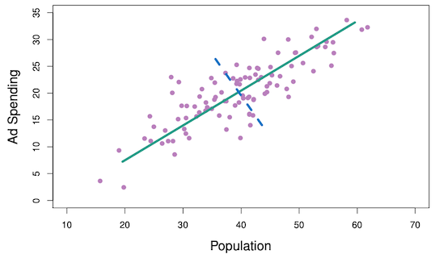

# 6.10: Unsupervised Learning Slides

```code
$ echo "Data Science Institute"
```
---

# Introduction

-   For **supervised learning** we usually have a set of features $X_1, \dots, X_p$ and a response $Y$ measured on $n$ observations. The goal is to _**♦️predict $Y$ using $X_1, \dots, X_p$♦️**_.

-   For **unsupervised learning** we have a set of features $X_1, \dots, X_p$ and measured on $n$ observations with no response variable. The goal is to _**♦️gain information about the features $X_1, \dots, X_p$♦️**_.

All the methods we have looked at so far in this module are for supervised learning. This section will cover a number of unsupervised learning methods such as:

-   Principal component analysis

-   Clustering methods

---

# Principal Component Analysis

Suppose that we want to visualize $n$ observations each containing $p$ features.

-   Scatter plots of the $n$ observations with different combinations of 2 features.
    -   For large $p$ this is unreasonable.

-   We need to find a low-dimensional representation of the data that captures as much information as possible.

_**♦️Principal Component Analysis (PCA) finds the small number of dimensions that the observations vary along the most.♦️**_

---

# The First Principal Component

Each dimension (or principal component) found by PCA is a linear combination of the $p$ features.

The **first principal component**: \quad $Z_{1}=\phi_{11} X_{1}+\phi_{21} X_{2}+\cdots+\phi_{p 1} X_{p}$

-   $\phi_{11}, \ldots, \phi_{p 1}$ are the **loadings** of the first principal component.
-   The loadings are normalized $\Rightarrow$ $\sum_{j=1}^{p} \phi_{j 1}^{2}=1$
-   The loadings are chosen to maximize the variance of $Z_1$.
-   Each feature $X_j$ has mean zero.

---

# The First Principal Component

More formally, the first principal loading vector $\phi_{1}=\left(\phi_{11} , \phi_{21} , \ldots , \phi_{p 1}\right)$ solves the following problem: 

> $\operatorname{maximize}_{\phi_{11}, \ldots, \phi_{p 1}}\left\{\frac{1}{n} \sum_{i=1}^{n}\left(\sum_{j=1}^{p} \phi_{j 1} x_{i j}\right)^{2}\right\} \text{ subject to } \sum_{j=1}^{p} \phi_{j 1}^{2}=1$

---

# The First Principal Component

To reiterate, the first principal component is $Z_{1}=\phi_{11} X_{1}+\phi_{21} X_{2}+\cdots+\phi_{p 1} X_{p}$

-   Each $X_j$ is the vector of $n$ observations for the $j$-th feature.
-   Thus, $Z_1$ is a vector with entries \quad $z_{i 1}=\phi_{11} x_{i 1}+\phi_{21} x_{i 2}+\cdots+\phi_{p 1} x_{i p}.$
-   $z_{11}, \ldots, z_{n 1}$ are called the **scores** of the first principal component.

---

# The First Principal Component

Here are a few useful interpretations of the first principal component:

1.  The loading vector $\phi_{1}=\left(\phi_{11} , \phi_{21} , \ldots , \phi_{p 1}\right)$ defines the direction in the feature space along which the data varies the most.

2.  The first principal component is the line in $p$-dimensional space that is closest to the $n$ observations.

---

# The First Principal Component

A data set with two features (Population and Ad Spending) is plotted below. The green curve is the first principal component.



1.  The first principal component is in the widest or most variable direction of the data.

2.  It is also the line in the 2-dimensional space that is closest to the observations.


---

# The Second Principal Component

Once we have found the first principal component $Z_1$, the second principal component $Z_2$ can be found.

_**♦️$Z_2$ is the linear combination of the features that again maximizes variance but is also uncorrelated with $Z_1$♦️**_.

-   The scores $z_{12}, z_{22}, \ldots, z_{n 2}$ are of the form $z_{i 2}=\phi_{12} x_{i 1}+\phi_{22} x_{i 2}+\cdots+\phi_{p 2} x_{i p}$
-   $Z_2$ is uncorrelated with $Z_1$ means that the direction $\phi_1$ is orthogonal (perperdicular) to the direction $\phi_1$.

---

# The Second Principal Component

A data set with two features (Population and Ad Spending) is plotted below. The green curve is the first principal component and the dashed blue curve is the second.


---

# The Second Principal Component

-   The direction of the second principle component is perpendicular to the direction of the first principle component.
-   Since there are only two dimensions there is only one choice for $\phi_2$.
-   If there were $p > 2$ features, there would be multiple directions to choose between.


---

# The Second Principal Component

The three dimensional data set with the first and second principal components defining the plane.


---

# The Second Principal Component

-   The plane is as close to the data points as possible.
-   It also follows the directions along which the data varies the most.
-   The colour in this plot it not important.


---

# Principal Component Analysis

We can continue to create the principal components by taking the linear combination of the features that maximizes variance while remaining uncorrelated with the previous components.

-   To make low-dimensional visualizations we can plot the scores for two principal components at a time.
-   Plot $Z_1$ against $Z_2$, $Z_1$ against $Z_3$, $Z_2$ against $Z_3$, and so on.
-   On the same plot we can plot the loading vectors on a different axis for each feature.
-   A plot with both the scores and loading vectors is called a biplot.

---
# Principal Component Analysis

A biplot for the first two principal components of a data set of 50 states with features {A, B, C, D}.


---

-   The state names are the scores for the first two principal components.
-   The orange letters are the loadings for each of the features (top and right axis)
-   The loading for feature B is approximately
    -   0.54 on the first component ($\phi_{B1} = 0.54$)
    -   0.17 on the first component ($\phi_{B2} = 0.17$)


---

# The Proportion of Variance Explained

The plot we saw is a two-dimensional representation of a four-dimensional data set.

-   How much information have we lost?
-   How much of the variance in the data is not captured by the first few principal components?

$\Rightarrow$ We want to know the **proportion of variance explained** (PVE) by each principal component.

---

# The Proportion of Variance Explained

Assuming that the features have been centered to have mean zero...

-   The **total variance** in a data set is: 
> $\sum_{j=1}^{p} \operatorname{Var}\left(X_{j}\right)=\sum_{j=1}^{p} \frac{1}{n} \sum_{i=1}^{n} x_{i j}^{2}$

-   The variance explained by the $m$th principal component is: 
> $\frac{1}{n} \sum_{i=1}^{n} z_{i m}^{2}=\frac{1}{n} \sum_{i=1}^{n}\left(\sum_{j=1}^{p} \phi_{j m} x_{i j}\right)^{2}$

-   The PVE of the $m$th principal component is: 
> $\frac{\sum_{i=1}^{n} z_{i m}^{2}}{\sum_{j=1}^{p} \sum_{i=1}^{n} x_{i j}^{2}}=\frac{\sum_{i=1}^{n}\left(\sum_{j=1}^{p} \phi_{j m} x_{i j}\right)^{2}}{\sum_{j=1}^{p} \sum_{i=1}^{n} x_{i j}^{2}}$

---

# The Proportion of Variance Explained

-   The cumulative PVE of the first $M$ principal components is the sum of the first $M$ PVEs.
-   There can be at most $\min(n-1, p)$ principal components.
-   The sum of the PVEs for all the principal components sums to one.
-   In the US state plot shown previously:
    -   The first principal component accounts for 60% of the variance in the data.
    -   The second principal component accounts for 25% of the variance in the data.
    -   Together they account for 87% of the variance in the data.

---

# Scaling the Features

_**♦️We scale each feature to have mean zero and standard deviation one before performing PCA.♦️**_


---

# Scaling the Features

-   Left: PCA biplot with variables scaled.


---

-   Right: Same data set but the variables have not been scaled.

    -   $\phi_1$ is mostly C.

    -   $\phi_2$ is mostly B.

-   The right plot does not show patterns as well.


---

# Uniqueness of the Principal Components

_**♦️Each principal component loading vector is unique up to a sign flip.♦️**_

-   The loading vector specifies a direction in the $p$-dimensional space.

-   Changing the sign of every element in the loading vector does not change the direction.

_**♦️The score vectors are unique up to a sign flip.♦️**_

-   $Z_1$ has the same variance as $Z_2$.

---

# How Many Principal Components to Use

$\rightarrow$   For a $n \times p$ data matrix $\mathbf{X}$ there are $\min(n-1, p)$ distinct principal components.

-  _**♦️Use the smallest number of principal components needed for a good understanding of the data.♦️**_

-   This will depend on the question and the data.
    -   Look at the first few principal components for patterns in the data.
    -   If there are none then the subsequent principal components will likely not help.
    -   If there are then look at the next principal components.

---
# How Many Principal Components to Use

$\rightarrow$   For a $n \times p$ data matrix $\mathbf{X}$ there are $\min(n-1, p)$ distinct principal components.

-   Alternatively, use a **scree plot** to decide.
    -   Plot of the proportion of variance explained versus the number of principal components
    -   Find the point where the the PVE is minimal for subsequent principal components.
-   Both methods are subjective which is why PCA is mostly used for exploratory data analysis.

---

# Scree Plot

-   Most of the variance is explained by the first two principal components.
-   The PVE levels off after this.
-   The third principal component accounts for less than 10% of the variance in the data.
-   2 principal components are probably sufficient to get a good understanding of this data set.


---

# Exercises: Principal Components Analysis

Open the Unsupervised Learning Exercises Jupyter Notebook file.

-   Go over the "Principal Components Analysis" section together as a class.

---

# Missing Values and Matrix Completion

The statistical learning methods we have learned in this course cannot handle missing predictor values. What can we do?

-   Remove rows that contain missing values.
-   If $x_{ij}$ is missing, replace it with the mean of the $j$th predictor.
-   Perform **matrix completion** which uses principal components to impute the missing values.

The first two methods are convenient but they do not exploit the correlation between the variables.

---

# Matrix Completion

_**♦️Matrix completion is only used when the reason for missing data is random♦️**_

-   Random: a patient's weight is missing from the data set because the scale battery died.
-   Not random: a patient's weight is missing because they are too heavy for the scale.

Matrix completion works by _**♦️simultaneously estimating the missing values and solving the principal components♦️**_ iteratively. We will not cover the algorithm but if you are interested see section 12.3 of ISLR2.

---

# Exercises: Matrix Completion

Open the Unsupervised Learning Exercises Jupyter Notebook file.

-   Go over the "Matrix Completion" section together as a class.

---

# Clustering Methods

Both PCA and clustering are unsupervised learning methods that attempt to simplify the data via summaries.

-   _**♦️Clustering methods aim to find subgroups (clusters) in a data set.♦️**_
-   Observations within a cluster are similar to each other and observations from different clusters are quite different.
-   The definitions of similar and different depend on the problem at hand.

There are many clustering methods but we will cover the two best-known:
-   $K$-means clustering
-   Hierarchical clustering

---

# $K$-Means Clustering

_**♦️$K$-means clustering seeks to partition a data set into $K$ distinct, non-overlapping clusters.♦️**_

1.  Specify the desired number of clusters $K$.
2.  Use the $K$-means algorithm to assign each observation to a cluster.


---

# $K$-Means Clustering

We need some notation:

-   $C_1, \dots, C_K$ are the sets containing the indices of the observations in each cluster. *(Ex: if the* $i$th observation is in the $k$th cluster then $i \in C_k$)
    -   Every observation belongs to a cluster.
    -   No observation belongs to more than one cluster.

Want to _**♦️choose clusters that minimize the \textbf{within-cluster variation}♦️**_ $W(C_k)$ for all clusters $C_k$.

$\rightarrow$ Minimize the amount by which observations within a cluster differ.

---

# Within-Cluster Variation

Within-Cluster variation for the $k$th cluster is the _**♦️sum of the pairwise squared Euclidean distances between each observation in the $k$th cluster, divided by the number of observations in the cluster♦️**_ ($|C_k|$). That is, 
> $W\left(C_{k}\right)=\frac{1}{\left|C_{k}\right|} \sum_{i, i^{\prime} \in C_{k}} \sum_{j=1}^{p}\left(x_{i j}-x_{i^{\prime} j}\right)^{2}$

The **Euclidean distance** is a way to measure distance in $p$-dimensional space. Suppose we have $\mathbf{x} = (x_1, \dots, x_p)$ and $\mathbf{y} = (y_1, \dots, y_p)$
, then the Euclidean distance is 

> $d(\mathbf{x}, \mathbf{y}) = \sqrt{(x_1 - y_1)^2 + \cdots + (x_p - y_p)^2}$ 

Note that we use the squared Euclidean distance in $W(C_k)$ so we remove the square-root.

---

# Within-Cluster Variation

To minimize within-cluster variation in all the $K$ clusters we need to solve 
> $\underset{C_{1}, \ldots, C_{K}}{\operatorname{minimize}}\left\{\sum_{k=1}^{K} \frac{1}{\left|C_{k}\right|} \sum_{i, i^{\prime} \in C_{k}} \sum_{j=1}^{p}\left(x_{i j}-x_{i^{\prime} j}\right)^{2}\right\}$

We use the $K$-means clustering algorithm!

---

# K-Means Clustering Algorithm

### K-Means Clustering Algorithm

1.  Randomly assign each observation a number between 1 and $K$. These are the initial cluster assignments.
2.  Repeat steps below until cluster assignments are static.

-   For each cluster compute the cluster **centroid**. The $k$th cluster centroid is the $p$ dimensional vector of the feature means for the observations in the $k$th cluster.
-   Assign each observation to the cluster with the closest centroid.

The results obtained depend on the initial random cluster assignment in step 1 of the algorithm.

---

# Means Clustering Algorithm

The $K$-means algorithm finds a **local optimum** which does not guarantee it is the **global optimum**.


To find the global optima:
1. Run the algorithm multiple times with random initial cluster assignments.
2. Choose the clustering that minimizes the within-cluster variation (1).

---

# Exercises: K-Means Clustering

Open the Unsupervised Learning Exercises Jupyter Notebook file.

-   Go over the "K-Means Clustering" section together as a class.

---

# Dendrogram

Hierarchical clustering results in a **dendrogram** which is a tree-based representation of the observations.


---

# Dendrogram

-   Each leaf (green stick) is an observation.
-   As we move up the dendrogram, observations that are similar fuse into branches.
-   Then branches fuse into other branches which indicates that the groups of observations are similar.
-   _**♦️The height at which two observations fuse indicates how different the two observations are.♦️**_

---

# Dendrogram


-   Observations 1 and 6 are quite similar since they fuse at the bottom of the dendrogram.
-   Observations 9 and 2 are quite dissimilar since they fuse near the top.

---

# Dendrogram


-   Observation 9 is equally similar to observations 2, 8, 5, and 7.
-   Thus, the horizontal axis tells us nothing about similarity.

---

# Clustering with a Dendrogram

_**♦️To create clusters we make a horizontal cut across the dendrogram. The distinct sets of observations beneath the cut are the clusters.♦️**_


-   Left: Cutting at a height of 9 results in two clusters.

---

# Clustering with a Dendrogram


-   Right: Cutting at a height of 5 results in three clusters.
-   We can obtain any number of clusters from a single dendrogram.
-   Usually the height of the cut is selected by eye based on the desired number of clusters.

---

# Dissimilarity Measures

In order to create a dendrogram, we need to define measures of dissimilarity between:

-   A pair of observations.
-   A pair of groups of observations.

The choice of dissimilarity measures have a strong influence on the shape of the dendrogram. The type of data and the question at hand should be considered.

---

# Dissimilarity Between Observations

The most common choice for dissimilarity between observations is **Euclidean distance**.

-   Observations that are close to each other are similar.

But in some cases, **correlation-based distance** might be preferred.

-   Observations with features that are highly correlated are similar.
-   This focuses on the shapes of the observation profiles rather than their magnitudes.

---

# Linkage

Linkage refers to the dissimilarity between two groups of observations. The four most common types of linkage are:

-   **Complete**
-   **Single**
-   **Average**
-   **Centroid**

---

# Complete Linkage

**Complete linkage** measures maximal intercluster dissimilarity.

1. Compute all pairwise dissimilarities between the observations in cluster A and B.
2. Record the largest of these dissimilarities.

---

# Single Linkage

**Single linkage** measures minimal intercluster dissimilarity.

1.  Compute all pairwise dissimilarities between the observations in cluster A and B.
2.  Record the smallest of these dissimilarities.

This type of linkage can result in trailing clusters in which a single observation is fused at a time. (i.e. leaves fuse to branches more often than branches fuse to branches)

---

# Average Linkage

**Average linkage** measures mean intercluster dissimilarity.

1.  Compute all pairwise dissimilarities between the observations in cluster A and B.
2.  Record the average of these dissimilarities.

---

# Complete Linkage

**Centroid linkage** measures intercluster centroid dissimilarity.


1.  Compute the dissimilarity of the centroid for cluster A (a vector of the feature means) and the centroid for cluster B.

Centroid linkage can result in **inversion** whereby two clusters are fused at a height below either of the individual clusters.

---

# Hierarchical Clustering Algorithm

### Hierarchical Clustering Algorithm

1.  Treat each of the $n$ observations are its own cluster.
2.  Compute the pairwise dissimilarity between each observation.
3.  For $i = n, n-1, \dots, 2$:

-   Identify the pair of clusters that are the least dissimilar among the $i$ clusters.
-   Fuse these two clusters in the dendrogram at the height that indicates their dissimilarity.
-   Compute the new pairwise inter-cluster dissimilarities among the $i - 1$ remaining clusters.

---

# Hierarchial Clustering Algorithm

The first iteration of the algorithm on a data set of 9 observations with two features. Euclidean distance and complete linkage are used.


---

# Hierarchial Clustering Algorithm


-   Left: there are 9 clusters each containing one observation.
-   Right: identify {7} and {5} as the most similar clusters and fuse them.

---

# Hierarchial Clustering Algorithm

The next 2 iterations of step 3 of the algorithm.


---

# Hierarchial Clustering Algorithm


-   Left: there are 9 clusters each containing one observation.
-   Right: identify {7} and {5} as the most similar clusters and fuse them.

---

# Linkage

The choice of the linkage type will have an effect on the dendrogram produced by the hierarchical clustering algorithm.


---

# Exercises: Hierarchical Clustering

Open the Unsupervised Learning Exercises Jupyter Notebook file.

-   Go over the "Hierarchical Clustering" section together as a class.

---

# References

Chapter 12 of the ISLR2 and ISLP books:

James, Gareth, et al. "Unsupervised Learning." An Introduction to Statistical Learning: with Applications in R, 2nd ed., Springer, 2021.

James, Gareth, et al. "Unsupervised Learning." An Introduction to Statistical Learning: with Applications in Python, Springer, 2023.

Local optima photo:

By Christoph Roser at AllAboutLean.com under the free CC-BY-SA 4.0 license.
