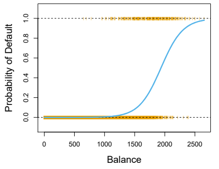

# 5: Logistic Regression

```code
$ echo "Data Science Institute"
```

---
# Use Case
- Assume you are a Data Scientist working for a credit card company. You are asked to build a model to predict whether a customer will go default. 
- The response variable Y is one of two categories, Yes or No. 
- Rather than modeling this response Y directly, logistic regression models the probability that Y belongs to a particular category. In this example, logistic regression models the probability of *default*.
For example, the probability of *default* given *balance* can be written as:
$$
\text{Pr(default = Yes|balance)}
$$
---
# Use Case Continue
- $\text{Pr(default = Yes|balance)}$, we usually abbreviate $p(\text{balance})$ will range between 0 and 1
- For any given value of balance, a prediction can be made for default.
- For example we may predict default = Yes if $p(\text{balance})>0.5$, or $p(\text{balance})>0.1$ for some conservative company

---
# Logistic Regression
How should we model the relationship between $p(X) = Pr(Y = 1|X)$ and $X$? We can consider using a linear regression model to represent these probabilities:
$$
p(X) = \beta_0 + \beta_1X
$$
Can you think of the drawback of this approach?

---
# Logistic function
If we use this approach then we obtain the model shown below:


---
# Logistic function
To avoid this problem, we must model $p(X)$ using a function that gives outputs between 0 and 1 for all values of $X$. In logistic regression, we use the *logistic function*:
$$
p(X) = \frac{e^{\beta_0 + \beta_1X}}{1+e^{\beta_0 + \beta_1X}}
$$


---

# Logistic Regression

**Logistic regression** models the probability that the response $Y$ belongs to a particular category. Suppose we have a qualitative response $Y$ that has two levels, coded as 0 and 1, and one predictor variable. We want to model


> $
p(X)=\operatorname{Pr}(Y=1 \mid X)
$

The logistic function keeps the probabilities between 0 and 1. For one predictor, the function is 
> $
p(X)=\frac{e^{\beta_{0}+\beta_{1} X}}{1+e^{\beta_{0}+\beta_{1} X}}
$ As with linear regression, we are trying to fit $\beta_0, \beta_1$.

---

# Estimating the regression coefficients

$\beta_0$ and $\beta_1$ are estimated using the training data using a method called **maximum likelihood**. This involves maximizing the likelihood function, but we will not cover the details of this function.

---

# Odds

The **odds** compares the probability of a particular outcome to the probability of all the other outcomes.


> $
    \frac{p(X)}{1-p(X)}=e^{\beta_{0}+\beta_{1} X}
$

-   takes values between (0, $\infty$)

-   odds close to 0 $\Rightarrow$ very low probability of the outcome in question

-   odds much greater than 0 $\Rightarrow$ very high probability of the outcome in question.

---

# Log Odds

The **log odds** (or *logit*) is obtained by taking the logarithm of the odds 
> $
\log \left(\frac{p(X)}{1-p(X)}\right)=\beta_{0}+\beta_{1} X
$

-   Increasing $X$ by one unit changes the log odds by $\beta_1$.

-   If $\beta_1$ is positive, increasing $X$ is associated with increasing $p(X)$

-   If $\beta_1$ is negative, increasing $X$ is associated with decreasing $p(X)$

---

# Making Predictions

Once the coefficients have been estimated predictions can be made for any value of the predictor. Logistic regression will give the probability of the outcome and the classification will be according to some threshold which depends on the problem or how conservative the predictions should be.

---

# Example
Recall the `Default` use case. Let's assume you fit a logistic regression and get the following results from any statistics software:


- A one-unit increase in balance is associated with an increase in the **log odds** of default by 0.0055 units.
- For an individual with a balance of $1000 is
$$
\hat{p}(x) = \frac{e^{\hat{\beta_0} + \hat{\beta_1}X}}{1+e^{\hat{\beta_0} + \hat{\beta_1}X}} = \frac{e^{-10.6513+0.0055*1000}}{1+e^{-10.6513+0.0055*1000}} = 0.00576
$$
- Question: Can you compute the estimated default probability of a customer with a balance of \$2000?
---

# Multiple Predictors

Simple logistic regression can be extended to include multiple predictors 
> $
p(X)=\frac{e^{\beta_{0}+\beta_{1} X_{1}+\cdots+\beta_{p} X_{p}}}{1+e^{\beta_{0}+\beta_{1} X_{1}+\cdots+\beta_{p} X_{p}}}$

The log odds in this case becomes 
> $
\log \left(\frac{p(X)}{1-p(X)}\right)=\beta_{0}+\beta_{1} X_{1}+\cdots+\beta_{p} X_{p}$

As before, the maximum likelihood is used to estimate the coefficients.

---

# Exercise: Logistic Regression

Open the Classification Exercises R Markdown or Jupyter Notebook file.

-   Go over "Getting Started" together as a class.

-   Go through the "Logistic Regression" as a class.

-   5 minutes for students to complete the questions from "Logistic Regression".

-   Questions should be completed at home if time does not allow.

---

# References

Chapter 4 and section 2.2.3 of the ISLP book:

James, Gareth, et al. "Classification." An Introduction to Statistical Learning: with Applications in Python, Springer, 2023.
