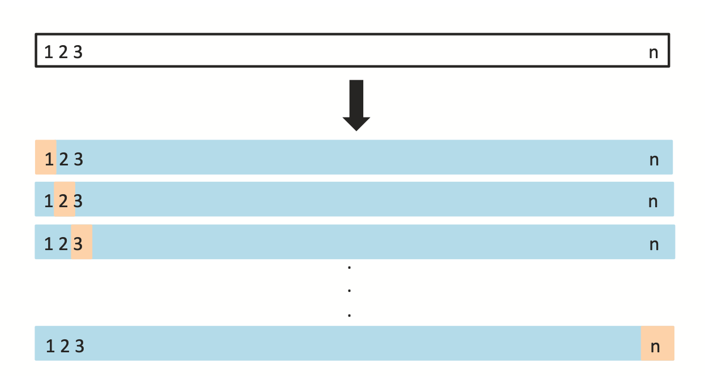

# 7: Resampling Methods (Leave One Out Cross Validation)

```code
$ echo "Data Science Institute"
```

---

# Introduction

Resampling methods work by first drawing a sample from the training data set and then fitting the statistical model of interest on this subset of the data. This process is repeated many times which allows us to gain more information about a model without requiring more data.

This week will cover two resampling methods:

-   Cross-validation
-   The bootstrap

---

# The Validation Set Approach

The **validation set approach** estimates the test error associated with fitting a statistical model to a set of observations.

-   Randomly divide the set of observations into a _**♦️training set♦️**_ and a _**♦️validation set♦️**_.

-   Fit the model on the training set.

-   Predict responses on the validation set.

-   The error rate of the validation set gives an estimate of the test error rate.

---

# The Validation Set Approach

Finding the error rate of the validation set depends on the statistical model.

-   In the regression setting mean squared error (MSE) is usually used.

-   In the classification setting, the number of misclassified observations is used.

---

# Breakout Room

What are some drawbacks to the Validation Set Approach?

---

# The Validation Set Approach

There are two potential drawback to this approach:

-   The ♦️validation set error rate can be highly variable♦️ since it depends on which observations are included in the training set versus the validation set.

-   The validation set error rate may ♦️overestimate the test error rate♦️ since the model is being fit on a smaller training set.

Cross-validation is an extension of the validation set approach that accounts for these issues.

---

# Exercises: The Validation Set Approach

Open the Resampling Methods Jupyter Notebook file.

-   Go over the "Getting Started" section together as a class.
-   Go over the "The Validation Set Approach" section together as a class.
-   10 minutes for students to complete the questions from "The Validation Set Approach".
-   Questions should be completed at home if time does not allow.

---

# Leave-One-Out Cross-Validation

Leave-one-out cross-validation (LOOCV) follows the same steps as the validation set approach except the _**♦️validation set is just one single observation♦️**_. Then,

-   Fit model on the training data set.

-   Make prediction for the response of the one validation observation using the fitted model.

-   Compute the validation set error.

-   Repeat this process for every observation.

---
# Leave-One-Out Cross-Validation



---

# Leave-One-Out Cross-Validation

The LOOCV estimate of the test error is the average of all $n$ of the validation set errors.

$CV_{(n)}=\frac{1}{n}\sum\limits_{i=1}^nMSE_i$

---

# Breakout Room

How is the LOOCV approach better than the validation set approach?

---

# Leave-One-Out Cross-Validation

How is the LOOCV approach better than the validation set approach?

-   It has _**♦️less bias♦️**_ and _**♦️does not overestimate the test error rate♦️**_ as much since it is using a lot more observations to train the model.

-   The LOOCV result will not vary since there is no randomness in the training and validation set splits.

---

# Exercises: Leave-One-Out Cross-Validation

Open the Leave-One-Out Cross-Validation Jupyter Notebook file.

-   Go over the "Leave-One-Out Cross-Validation" section together as a class.
-   Questions should be completed at home if time does not allow.

---

# References

Chapter 5 of the ISLP book:

James, Gareth, et al. "Resampling Methods." An Introduction to Statistical Learning: with Applications in Python, Springer, 2023.
