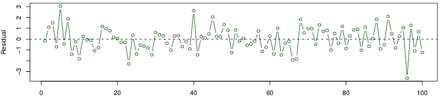

# 6.2: Linear Regression

```code
$ echo "Data Science Institute"
```

---

# Motivation

Throughout this Module we will be making use of the `Boston` dataset in the Python package `ISLP`. We can use the terminal to install the Python package and use the `load_data` function from the `ISLP` package to load the `Boston` dataset:

```         
pip install ISLP
from ISLP import load_data
Boston = load_data("Boston")
```

---
# Motivation

The `Boston` dataset contains housing values in 506 Boston suburbs along with 12 other variables associated with the suburbs. To name a few,

-   `rm`: average number of rooms per dwelling
-   `nox`: nitrogen oxides concentration (parts per 10 million)
-   `lstat`: percent of households with low socioeconomic status

We can take `medv`, the median value of owner-occupied homes in \$1000s, to be the response variable $Y$ and the 12 other variables to be the predictors $X = (X_1, \dots, X_{12})$.

---

# Motivation

There may be some specific question we'd like to address

-   Is there a relationship between the 12 variables and housing price?
    -   Does the data provide evidence of an association?
-   Are all of the 12 variables associated with housing price?
    -   Perhaps only a few of the variables have an effect on housing price.
-   How accurate are the predictions for housing prices based on these variables?
-   Is the relationship between the variables and housing price linear?
    -   Perhaps we can transform some variables to make the relationship linear.

_**All of these questions can be answered using linear regression!**_

---

# Simple Linear Regression

**Simple linear regression** uses a *single* predictor variable $X$ to predict a *quantitative* response $Y$ by assuming the relationship between them is linear. $Y \approx \beta_0 + \beta_1 X$

-   $\beta_0$ and $\beta_1$ are the model **parameters** which are unknown.
-   $\beta_0$ is the intercept term and $\beta_1$ is the slope term.

We can use the training data to produce estimates $\hat \beta_0$ and $\hat \beta_1$ and predict future responses

$\hat{y} \approx \hat{\beta_0} + \hat{\beta_1} X$

---

# Estimating the Coefficients

Suppose we have $n$ observations in our training data which each consists of a measurement for $X$ and $Y$ represented by $
(x_1, y_1),\ (x_2, y_2), \dots,\ (x_n, y_n)
$

We want to find estimates for $\hat \beta_0$ and $\hat \beta_1$ such that for all $i = 1, \dots, n$ $
y_i \approx \hat y_i
$

where $\hat y_i = \hat \beta_0 + \hat \beta_1 x_i$ is the prediction for $y_i$ given $x_i$.

The most common method used to measure the difference between $y_i$ and $\hat y_i$ is the least squares criterion. The idea being that _**we want to find the $\hat \beta_0$ and $\hat \beta_1$ that give us the smallest difference**_.

---

# Least Squares Criterion

We define the $i$th **residual** to be the difference between the $i$th observed response value and the $i$th predicted response value: $
e_i = y_i - \hat y_i
$

The **residual sum of squares** (RSS) is the following $
\operatorname{RSS} = e_1^2 + \cdots + e_n^2 
= \left(y_{1}-\hat{\beta}_{0}-\hat{\beta}_{1} x_{1}\right)^{2}+\cdots+\left(y_{n}-\hat{\beta}_{0}-\hat{\beta}_{1} x_{n}\right)^{2}
$

### The RSS is minimized by the estimates below (where $\bar{x},\ \bar{y}$ are the sample means):

$
\begin{aligned}
\hat{\beta}_{1}&=\frac{\sum_{i=1}^{n}\left(x_{i}-\bar{x}\right)\left(y_{i}-\bar{y}\right)}{\sum_{i=1}^{n}\left(x_{i}-\bar{x}\right)^{2}} \\
\hat{\beta}_{0}&=\bar{y}-\hat{\beta}_{1} \bar{x}
\end{aligned}
$ _**So $\hat \beta_1$ and $\hat \beta_0$ definte the least squares coefficient estimates**_

---

# Assessing the Accuracy of the Coefficient Estimates

Recall from section 6.1 that we assume the true relationship between the predictor $X$ and the response $Y$ is

> $Y = f(X) + \epsilon$ 

where $f$ is an unknown function and $\epsilon$ is the random error with mean zero. By assuming $f$ is linear, we obtain 
    
> $Y = \beta_0 + \beta_1 X + \epsilon$

Now suppose we have the least squares coefficient estimates $\hat \beta_0$ and $\hat \beta_1$, so 
    
> $\hat Y = \hat \beta_0 + \hat \beta_1 X$ 

We would like to assess the how close $\hat \beta_0$ and $\hat \beta_1$ are to the true parameter values $\beta_0$ and $\beta_1$.

---

# Standard Error

We can compute the **standard erorrs** associated with $\hat \beta_0$ and $\hat \beta_1$ with the following: 

> $\operatorname{SE}\left(\hat{\beta}_{0}\right)^{2}=\sigma^{2}\left[\frac{1}{n}+\frac{\bar{x}^{2}}{\sum_{i=1}^{n}\left(x_{i}-\bar{x}\right)^{2}}\right], \quad \quad  \operatorname{SE}\left(\hat{\beta}_{1}\right)^{2}=\frac{\sigma^{2}}{\sum_{i=1}^{n}\left(x_{i}-\bar{x}\right)^{2}}$

where $\sigma^2 = \operatorname{Var}(\epsilon)$ and is usually unknown. Luckily, $\sigma$ can be estimated from the data using the **residual standard error** (RSE) 

> $\operatorname{RSE} = \sqrt{\frac{\operatorname{RSS}}{(n-2)}}$

The standard errors for $\hat \beta_0$ and $\hat \beta_1$ can be used to compute confidence intervals of the estimates or perform hypothesis tests on the coefficients.

---

# Hypothesis Tests on the Coefficients

Once we have the standard errors, we can perform a hypothesis test on the coefficients to determine whether there is a relationship between $X$ and $Y$. 
The _**null hypothesis**_ is 
> $H_0: \text{ There is no relationship between } X \text{ and } Y$ 

and the _**alternative hypothesis**_ is 
> $H_{a}: \text { There is some relationship between } X \text { and } Y$

Mathematically, this is 
> $H_0: \beta_1 = 0 \quad \text{versus} \quad H_a: \beta_1 \neq 0$

since if $\beta_1 = 0$ then $Y = \beta_0 + \epsilon$ so $Y$ is not associated with $X$.

---

# Hypothesis Tests on the Coefficients

In order to test the null hypothesis, we need to determine whether $\hat \beta_1$ is sufficiently far from zero. The $\mathbf{t}$**-statistic** 
> $t=\frac{\hat{\beta}_{1}-0}{\operatorname{SE}(\hat{\beta}_{1})}$ 

measures the number of standard deviations that $\hat \beta_1$ is away from 0. The $p$-value can be computed from the $t$-statistic which will allow us to either accept or reject our null hypothesis.

---

# Assessing the Accuracy of the Model

The quality of the linear regression fit is often assessed with the residual standard error (RSE) and the $R^2$ statistic.

-   The RSE gives an absolute _**measure of lack of fit of the model to the data.**_
-   The $\mathbf{R^2}$ **statistic** measures _**the proportion of variability in $Y$ that can be explained by $X$.**_

We've already seen how the RSE is computed from the RSS and the $R^2$ statistic can be computed using 
> $R^{2}=1-\frac{\mathrm{RSS}}{\mathrm{TSS}}$

where $\mathrm{TSS}=\sum\left(y_{i}-\bar{y}\right)^{2}$ is the **total sum of squares** which measures the amount of variability in the responses before regression is performed.

---

# Simple Linear Regression Summary

Simple linear regression uses a single predictor variable $X$ to predict a response $Y$ with 
> $Y \approx \beta_{0}+\beta_{1} X$

- $\beta_{0}, \beta_{1}$ are estimated by minimizing the residual sum of squares (RSS)

- The standard error (SE) of the coefficient estimates is a measure of accuracy.

- The residual standard error (RSE) gives a measure of lack of fit of the model to the data.

- The $R^2$ statistic measures the proportion of variability explained by the regression. - A hypothesis test on $\beta_1$ indicates whether there is a relationship between $X$ and $Y$.

**Any Questions?**

---

# Exercises: Simple Linear Regression

Open the Linear Regression Exercises R Markdown or Jupyter Notebook file.

-   Go over the "Simple Linear Regression" section together as a class.

---

# Multiple Linear Regression

Suppose we have $n$ observations in our data each consisting of $p$ predictor values and one response value. That is, 
> $\left\{\left(x_{1}, y_{1}\right),\left(x_{2}, y_{2}\right), \ldots,\left(x_{n}, y_{n}\right)\right\} \text { where } x_{i}=\left(x_{i 1}, x_{i 2}, \ldots, x_{i p}\right).$
 
We want to fit this data with a linear model. We can extend simple linear regression to accommodate $p$ predictors. 
> $Y=\beta_{0}+\beta_{1} X_{1}+\beta_{2} X_{2}+\cdots+\beta_{p} X_{p}+\epsilon$

_**We interpret $\beta_j$ as the average effect on $Y$ of one unit increase in $X_j$ while holding all other predictors fixed.**_

As with simple linear regression, the coefficients $\beta_0, \dots, \beta_p$ are unknown and must be estimated.

---

# Estimating the Coefficients

We want to find estimates $\hat \beta_0, \dots, \hat \beta_p$, so that predictions for the response can be made using 
> $\hat{y}=\hat{\beta}_{0}+\hat{\beta}_{1} x_{1}+\hat{\beta}_{2} x_{2}+\cdots+\hat{\beta}_{p} x_{p}.$
 
The least squares approach is used again in this case to estimate the $p$ parameters. That is, we choose $\beta_0, \dots, \beta_p$ to minimize the sum of the squared residuals 
> $\begin{aligned}
\mathrm{RSS} &=\sum_{i=1}^{n}\left(y_{i}-\hat{y}_{i}\right)^{2} \\
&=\sum_{i=1}^{n}\left(y_{i}-\hat{\beta}_{0}-\hat{\beta}_{1} x_{i 1}-\hat{\beta}_{2} x_{i 2}-\cdots-\hat{\beta}_{p} x_{i p}\right)^{2}
\end{aligned}$

The equations for $\hat \beta_0, \dots, \hat \beta_p$ which minimize the $RSS$ are complicated and not entirely important since there are functions that perform the computation for us in Python.

---

# Least Squares Regression Plane

The figure shows the relationship between two predictor variables and a response variable. Linear regression in this case gives a plane fit by minimizing the squared vertical distance between the observations and the plane.


---

# Important Questions

When working with multiple linear regression, we are often interested in several important questions.

-   Is there a relationship between the response and the predictors?

-   How well does the model fit the data?

-   Given a set of predictor values, what is the predicted response, and how accurate is our prediction? We will go over the methods for answering each of these questions.

---

# Hypothesis Test for Parameters

One: *Is there a relationship between the response and the predictors?*

We can address this question by testing whether the regression coefficients are far enough from zero.

Our null hypothesis and alternative hypothesis are the following: 
>$H_{0}: \beta_{1}=\beta_{2}=\cdots=\beta_{p}=0
\hspace{1cm}
H_{a}: \beta_{j} \neq 0 \text{ for some } j$

The hypothesis can be tested with the $\mathbf{F}$**-statistic**, which is defined by 
> $F=\frac{(\mathrm{TSS}-\mathrm{RSS}) / p}{\mathrm{RSS} /(n-p-1)}.$

If the $F$-statistic is much larger than 1 we reject the null hypothesis and conclude there is a relationship between at least on the the predictors and the response. If the $F$-statistic is close to 1, the $p$-value can be computed to determine the outcome.

---

# $RSE$ and $R^2$

Two: *How well does the model fit the data?*

The $\operatorname{RSE}$ and $R^2$ are measures of the model fit. In the multiple linear regression context, $R^2$ is the square of the correlation between the response and the fitted linear model. That is, $R^2 = \operatorname{Cor}(Y, \hat Y)^2$.

The $\operatorname{RSE}$ is defined by 
> $\mathrm{RSE}=\sqrt{\frac{\mathrm{RSS}}{n-p-1} } \hspace{1cm} \text{where } n = \text{\# observations},\ p = \text{\# predictors}$

Important considerations as the number of variables in the model increases:

-   $R^2$ will increase even if the new variables have a weak association with the response.

-   $RSS$ of the training data will decrease, but not necessarily that of the testing data.

-   $RSE$ will increase if the decrease in $RSS$ is small relative to the increase in $p$.

---

# Prediction Accuracy

Three: *Given a set of predictor values, what is the predicted response, and how accurate is our prediction?* Once we have fit the multiple regression model, the response $Y$ is predicted by 
> $\hat Y = \hat{\beta}_{0}+\hat{\beta}_{1} X_{1}+\cdots+\hat{\beta}_{p} X_{p}.$

There are three types of uncertainty associated with the prediction $\hat Y$

1.  The **reducible error** arising from the inaccuracy of the coefficient estimates.

2.  The reducible error stemming from the assumption that the relationship between $Y$ and $X$ is linear; **model bias**.

3.  The **irreducible error** from the random error associated with the true response $Y = f(x) + \epsilon$.

We can address how much $Y$ will vary from $\hat Y$ using prediction intervals.

---

# Exercises: Multiple Linear Regression

Open the Linear Regression Exercises R Markdown or Jupyter Notebook file.

-   Go over the "Multiple Linear Regression" section together as a class.

---

# Qualitative Predictors

So far we have only looked at using quantitative predictor variables for linear regression. However, sometimes the inclusion of qualitative variables is desirable.

Suppose we have the following information about a set of people:

-   $Y$: income (quantitative: \$ amount)

-   $X_1$: student status (qualitative: is a student or is not)

-   $X_2$: location of residence (qualitative: Toronto, Vancouver, Montreal)

We want to determine whether there is a relationship between income and the other two qualitative variables.

---

# Qualitative Predictors: Two Levels

Let's start by looking at the differences in income between students and non-students. Our qualitative predictor, or *factor*, has two levels so we can incorporate into a regression model using a **dummy variable** that takes on two possible numerical values. 
> $x_{i}=\left\{\begin{array}{ll}
1 & \text { if } i \text{th person is a student } \\
0 & \text { if } i \text{th person is not a student }
\end{array}\right.$

So we have the following model 
> $y_{i}=\beta_{0}+\beta_{1} x_{i}+\epsilon_{i}=\left\{\begin{array}{ll}
\beta_{0}+\beta_{1}+\epsilon_{i} & \text { if } i \text{th person is a student } \\
\beta_{0}+\epsilon_{i} & \text { if } i \text{th person is not a student }
\end{array}\right.$

-   $\beta_0$ is the average income for non-students.

-   $\beta_0 + \beta_1$ is the average income for students.

The method for fitting linear models with qualitative predictors using dummy variables remains the same.

---

# Qualitative Predictors: Multiple Level

Now let's look at the difference in income between the residents of Toronto, Vancouver, and Montreal. We can do this using two dummy variables.

> $\begin{aligned}
x_{i 1}&=\left\{\begin{array}{ll}
1 & \text { if } i \text {th person is from Vancouver } \\
0 & \text { if } i \text {th person is not from Vancouver }
\end{array}\right.
\\
x_{i 2}&=\left\{\begin{array}{ll}
1 & \text { if } i \text {th person is from Montreal } \\
0 & \text { if } i \text {th person is not Montreal }
\end{array}\right.
\end{aligned}$

The level with no dummy variable is known as the **baseline** (Toronto in this example). Our model is now 

> $y_{i}=\beta_{0}+\beta_{1} x_{i 1}+\beta_{2} x_{i 2}+\epsilon_{i}=\left\{\begin{array}{ll}
\beta_{0}+\beta_{1}+\epsilon_{i} & \text { if } i \text{th person is from Vancouver } \\
\beta_{0}+\beta_{2}+\epsilon_{i} & \text { if } i \text{th person is from Montreal } \\
\beta_{0}+\epsilon_{i} & \text { if } i \text{th person is from Toronto. }
\end{array}\right.$

---

# Qualitative Predictors: Multiple Levels

> $y_{i}=\beta_{0}+\beta_{1} x_{i 1}+\beta_{2} x_{i 2}+\epsilon_{i}=\left\{\begin{array}{ll}
\beta_{0}+\beta_{1}+\epsilon_{i} & \text { if } i \text{th person is from Vancouver } \\
\beta_{0}+\beta_{2}+\epsilon_{i} & \text { if } i \text{th person is from Montreal } \\
\beta_{0}+\epsilon_{i} & \text { if } i \text{th person is from Toronto. }
\end{array}\right.$

The coefficients can be interpreted as

-   $\beta_0$ the average income for people from Toronto

-   $\beta_1$ the difference in the average income between people from Vancouver versus Toronto

-   $\beta_2$ the difference in the average income between people from Montreal versus Toronto.

---

# Qualitative Predictors: Multiple Levels

> $y_{i}=\beta_{0}+\beta_{1} x_{i 1}+\beta_{2} x_{i 2}+\epsilon_{i}=\left\{\begin{array}{ll}
\beta_{0}+\beta_{1}+\epsilon_{i} & \text { if } i \text{th person is from Vancouver } \\
\beta_{0}+\beta_{2}+\epsilon_{i} & \text { if } i \text{th person is from Montreal } \\
\beta_{0}+\epsilon_{i} & \text { if } i \text{th person is from Toronto. }
\end{array}\right.$

1.  The choice of 0 and 1 as values for the dummy variable or the choice of the baseline category are arbitrary and will not change the results of the regression
2.  These choices will impact the interpretation of the coefficients and their $p$-values.
3.  Use an F-test to test $H_0$ : $\beta_1 = \beta_2 = 0$.

---

# Exercises: Qualitative Predictors

Open the Linear Regression Exercises Jupyter Notebook file.

-   Go over the "Qualitative Predictors" section together as a class.

---

# Extensions of the Linear Model

Two of the most important and restrictive assumptions for linear regression models are

-   The relationship between the predictors and the response is _**additive**_.
    - *The association between a predictor and the response does not depend on any of the other predictors.*
-   The relationship between the predictors and the response is _**linear**_.
    - *A one-unit change in a predictor induces a constant change in the response regardless of the value of the predictor.*

We will examine the relaxation of the additive assumption but modifications to the linear assumption will be left until section 6.6.

---

# Removing the Additive Assumption

Consider the following linear regression model with two predictors 
> $Y=\beta_{0}+\beta_{1} X_{1}+\beta_{2} X_{2}+\epsilon$
 
We can include the product of $X_1$ and $X_2$ as a third predictor called the **interaction term**. 
> $Y=\beta_{0}+\beta_{1} X_{1}+\beta_{2} X_{2}+♦️\beta_{3} X_{1} X_{2}♦️+\epsilon$

This means that a change in the value of $X_2$ will change the association between $X_1$ and $Y$.

We can look at the $p$-value for $H_0: \beta_3 = 0$ to determine whether the interaction term is justified.

The **hierarchical principal**: when including an interaction in a model, the main effects should also be included even if the $p$-values for these coefficients are not significant.

---

# Exercises: Interaction Term

Open the Linear Regression Exercises Jupyter Notebook file.

-   Go over the "Interaction Term" section together as a class.

---

# Potential Problems

There are quite a few problems that can arise when fitting a linear regression model to a data set.

-   Non-linear response-predictor relationship

-   Correlation of error terms

-   Non-constant variance of error terms

-   Outliers

-   High-leverage points

We will briefly explain how to identify these problems but we will wait to provide solutions until later sections within this module.

---

# Non-Linearity

Linear regression assumes a linear relationship between the predictors and the response. If this assumption is invalid then conclusions derived from the model are flawed.

Identification:

-   Plot the residuals $e_i = y_i - \hat y_i$ versus the predictor $x_i$ (or versus $y_i$ in the case of multiple regression)

-   There should be no discernible pattern in the residuals, otherwise this may indicate non-linearity.

---

# Non-Linearity

Plot of the residuals versus the predicted values for a linear regression fit to a dataset.


--- 

# Non-Linearity

There is a clear trend in the residuals illustrated by the red curve which could indicate patterns in the data that are not captured by the linear model.


---
# Correlation of Errors

Linear regression assumes that the error terms $\epsilon_{1}, \epsilon_{2}, \ldots, \epsilon_{n}$ are uncorrelated (i.e. the value of $\epsilon_{i}$ is unrelated to the value for $\epsilon_{i+1}$). If this is violated, the estimated standard errors are much smaller than the truth, leading to unwarranted confidence in the model.

Examples

-   correlation between consecutive observations in time series data.

-   observations are related in some other way (ex: individuals are members of the same family or have been exposed to the same environmental factors).

Identification for time series:

-   Plot residuals versus time.

-   Look for temporal patterns that could indicated correlation of error terms.

---

# Correlation of Errors

Both plots show the residuals from a linear regression fit to time series data versus time. The top plot shows no correlation between the residuals whereas the bottom plot clearly has a time dependent structure.




---

# Non-Constant Variance of Errors

Linear regression also assumes constant variance of the error terms, $\operatorname{Var}(\epsilon_i) = \sigma^2$. If this assumption is invalid, the standard errors, confidence intervals, and hypothesis tests for the linear model are undermined.

Identification:

1.  Plot the residuals versus the response.

2.  Look for a funnel shape in the plot (this indicates an increase or decrease in the variance of the errors as a function of the response)

---

# Non-Constant Variance of Errors

Plot for the residuals versus the fitted values of a linear regression model.


---

# Non-Constant Variance of Errors

The residuals show a clear funnel shape with increasing response values resulting in increasing variance of the error terms.


---

# Outliers

**Outliers** are data points that have unusual values for $y_i$ given an unremarkable $x_i$. That is, $y_i$ is far from the value predicted by the model for $x_i$. Outliers can occur as a result of an error in data collection or a variety of other reasons.

Outliers often have little effect on the parameter fitting, but they can alter the $RSE$ and $R^2$ which can impact the interpretation of the fit.

Identification:

1.  Plot the **studentized residuals** which are computed by dividing the residuals $e_i$ by the estimated standard error.
2.  Observations with studentized residuals greater than 3 or less than -3 are probably outliers.

---

# Outliers

Plot of the studentized residuals versus the response values.


The red point at the top of the plot is above 3 which indicates it is an outlier.

---

# High Leverage Points

**High leverage points** are observations that have an unusual predictor value. These points tend to impact the fitted regression quite a bit and are therefore very important to identify.

Identification:

-   In simple linear regression, look for observations with a predictor value that is far outside the range of the rest.
-   In multiple regression, we are looking for an unusual combination of predictors which can be harder to identify
    -   Compute the leverage statistic for each observation.
    -   If the leverage statistic is much greater than $(p+1)n$, the observation may have high leverage.

---

# High Leverage Points

The left plot shows the response versus the predictors for a simple linear regression. The right plot show the studentized residuals versus the leverage.


Observation 41 in the left plot has a very large predictor value which indicates it is a high leverage point. This is confirmed in the right plot by the leverage index. The right plot also indicates 41 has a larger studentized residual (as does observation 20) so 41 is an outlier and a high leverage point.

---

# Exercises

Open the Linear Regression Exercises Jupyter Notebook file.

-   Go over the "Helpful Plots" section together as a class.

-   Complete the exercises at the end of the file.

---

# References

Chapter 3 of the ISLR2 and ISLP books:

James, Gareth, et al. "Linear Regression." An Introduction to Statistical Learning: with Applications in R, 2nd ed., Springer, 2021.

James, Gareth, et al. "Linear Regression." An Introduction to Statistical Learning: with Applications in Python, Springer, 2023.
